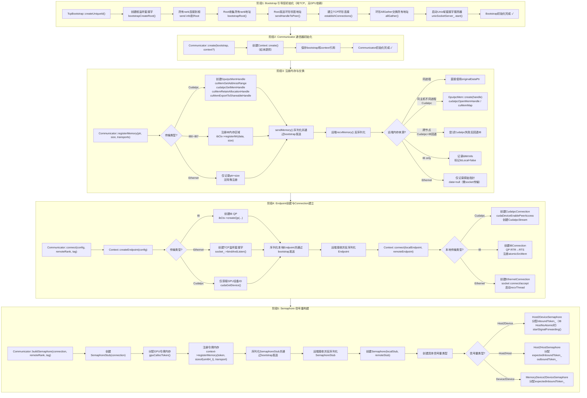
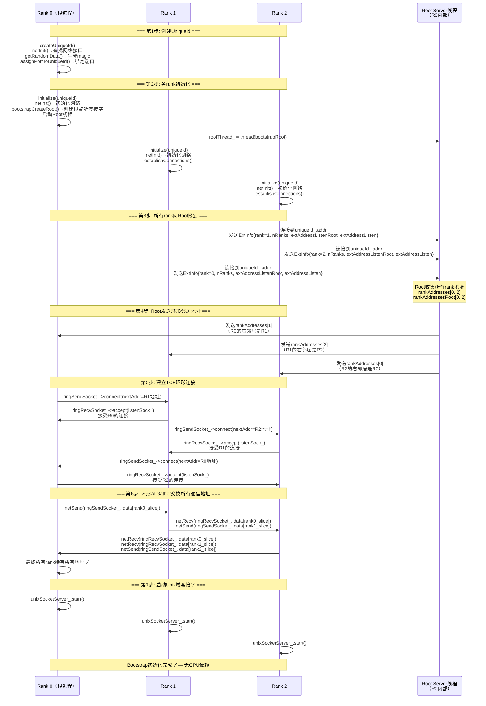
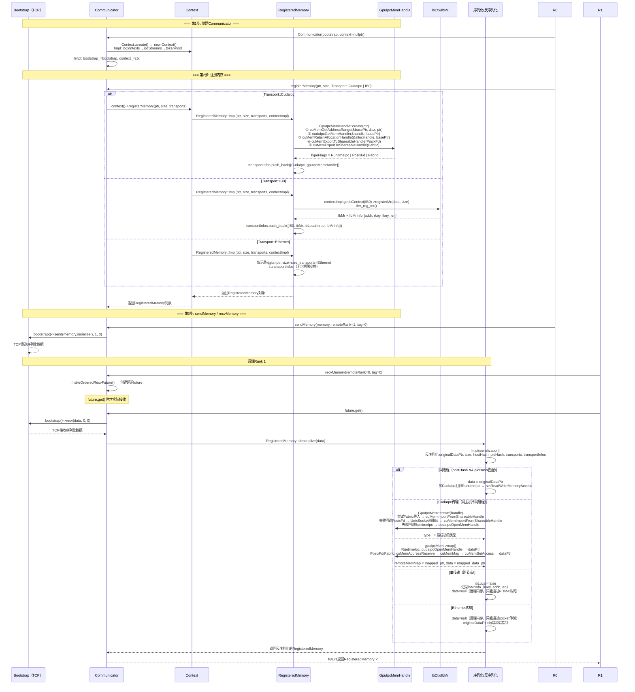
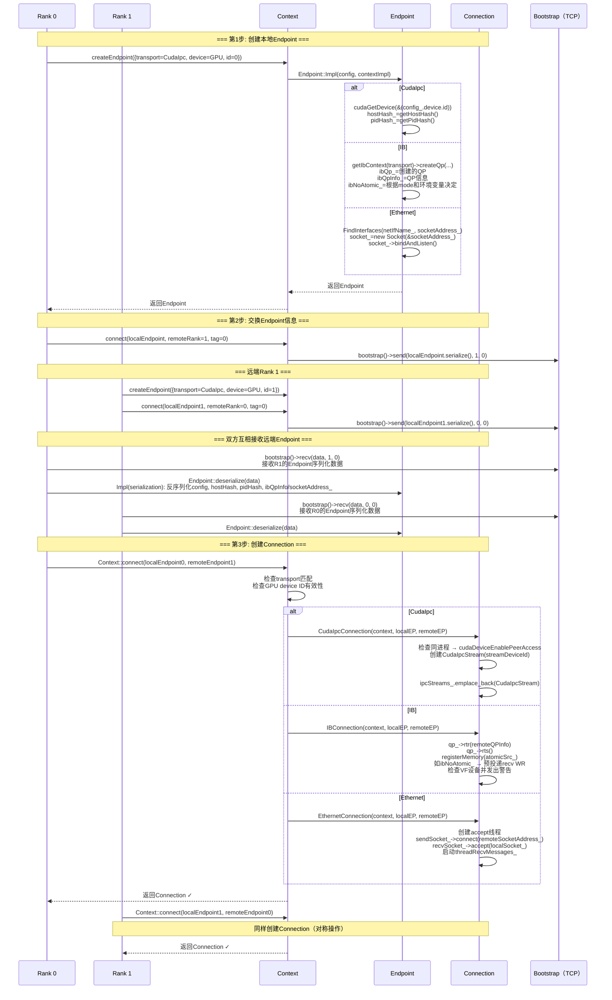
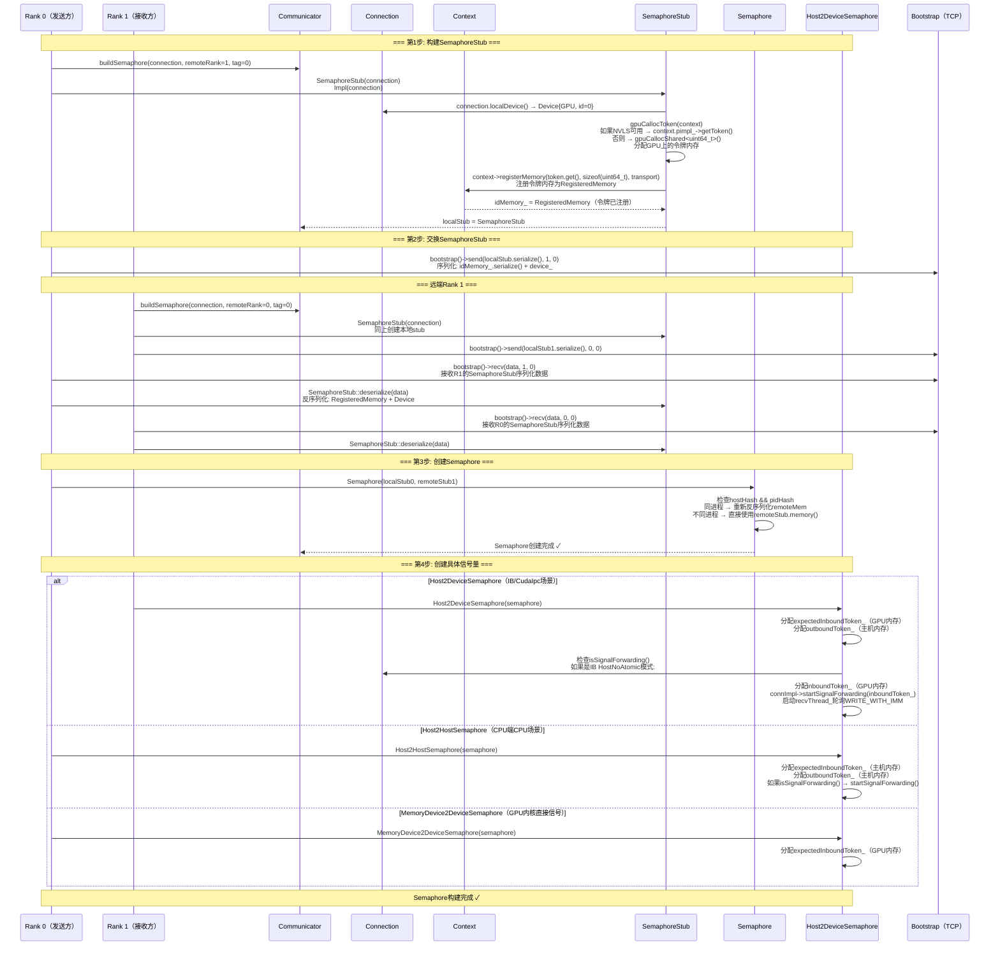
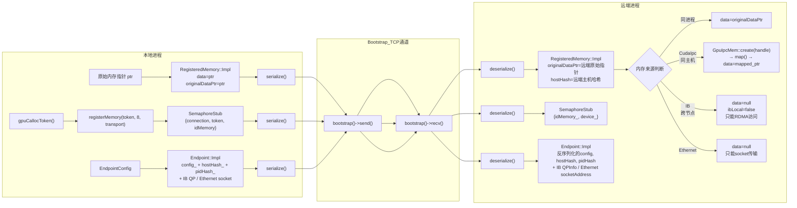

# MSCCL++ 初始化过程完整分析

> 分析日期：2026-06-03  
> 目标：详细解析 MSCCL++ 从 Bootstrap 到 Communicator 全链路初始化过程，包含类图、流程图、时序图，并对所有类/方法/变量/函数添加中文注释。

---

## 1. 核心类图

```mermaid
classDiagram
    direction TB

    class Bootstrap_引导基类 {
        <<abstract>>
        +getRank() int 获取进程排名
        +getNranks() int 获取总进程数
        +getNranksPerNode() int 获取每节点进程数
        +send(data, size, peer, tag) void 发送原始数据
        +recv(data, size, peer, tag) void 接收原始数据
        +allGather(allData, size) void 全收集操作
        +barrier() void 全局屏障
        +groupBarrier(ranks) void 组内屏障
        +send(data_vec, peer, tag) void 发送向量数据
        +recv(data_vec, peer, tag) void 接收向量数据
    }

    class TcpBootstrap_TCP引导 {
        -pimpl_ unique_ptr~Impl~ PIMPL实现指针
        +createUniqueId() UniqueId 创建随机唯一ID
        +TcpBootstrap(rank, nRanks) 构造函数
        +getUniqueId() UniqueId 获取存储的唯一ID
        +initialize(uniqueId, timeoutSec) void 用UniqueId初始化
        +initialize(ifIpPortTrio, timeoutSec) void 用IP:端口字符串初始化
        +getRank() int 获取进程排名
        +getNranks() int 获取总进程数
        +getNranksPerNode() int 获取每节点进程数
        +send(data, size, peer, tag) void 发送数据
        +recv(data, size, peer, tag) void 接收数据
        +allGather(allData, size) void 全收集
        +broadcast(data, size, root) void 环形广播
        +barrier() void 全局屏障
    }

    class TcpBootstrapImpl_TCP引导内部实现 {
        -uniqueId_ UniqueIdInternal 内部唯一ID
        -rank_ int 进程排名
        -nRanks_ int 总进程数
        -nRanksPerNode_ int 每节点进程数
        -netInitialized bool 网络是否已初始化
        -listenSockRoot_ unique_ptr~Socket~ 根监听套接字
        -listenSock_ unique_ptr~Socket~ 本进程监听套接字
        -ringRecvSocket_ unique_ptr~Socket~ 环形接收套接字
        -ringSendSocket_ unique_ptr~Socket~ 环形发送套接字
        -peerCommAddresses_ vector~SocketAddress~ 所有进程的通信地址
        -peerSendSockets_ unordered_map 发送套接字缓存
        -peerRecvSockets_ unordered_map 接收套接字缓存
        -unixSocketServer_ UnixSocketServer Unix域套接字服务器
        +createUniqueId() UniqueId 创建唯一ID
        +initialize(uniqueId, timeoutSec) void 初始化
        +establishConnections(timeoutSec) void 建立TCP环形连接
        +bootstrapCreateRoot() void 创建根服务器
        +bootstrapRoot() void 根服务器主循环
        +allGather(allData, size) void 环形全收集
        +send(data, size, peer, tag) void 发送数据
        +recv(data, size, peer, tag) void 接收数据
        +barrier() void 全收集屏障
        +close() void 关闭所有连接
    }

    Bootstrap_引导基类 <|-- TcpBootstrap_TCP引导
    TcpBootstrap_TCP引导 *-- TcpBootstrapImpl_TCP引导内部实现 : pimpl_

    class Communicator_通信器 {
        -pimpl_ unique_ptr~Impl~ PIMPL实现指针
        +Communicator(bootstrap, context) 构造函数_传入引导和上下文
        +bootstrap() shared_ptr~Bootstrap~ 获取引导对象
        +context() shared_ptr~Context~ 获取上下文对象
        +registerMemory(ptr, size, transports) RegisteredMemory 注册内存区域
        +sendMemory(memory, remoteRank, tag) void 发送已注册内存信息
        +recvMemory(remoteRank, tag) shared_future~RegisteredMemory~ 接收已注册内存信息
        +connect(localEndpoint, remoteRank, tag) shared_future~Connection~ 建立连接
        +connect(localConfig, remoteRank, tag) shared_future~Connection~ 建立连接_简化版
        +buildSemaphore(connection, remoteRank, tag) shared_future~Semaphore~ 构建信号量
        +remoteRankOf(connection) int 获取连接的远端排名
        +tagOf(connection) int 获取连接的标签
    }

    class CommunicatorImpl_通信器内部实现 {
        -bootstrap_ shared_ptr~Bootstrap~ 引导对象
        -context_ shared_ptr~Context~ 上下文对象
        -connectionInfos_ unordered_map 连接信息映射
        -lastRecvItems_ unordered_map 最近接收项映射
        -localRecvMemories_ unordered_map 本地接收内存映射
    }

    Communicator_通信器 *-- CommunicatorImpl_通信器内部实现 : pimpl_

    class Context_上下文 {
        -pimpl_ unique_ptr~Impl~ PIMPL实现指针
        +create()$ shared_ptr~Context~ 创建新上下文
        +registerMemory(ptr, size, transports) RegisteredMemory 注册内存区域
        +createEndpoint(config) Endpoint 创建端点
        +connect(localEndpoint, remoteEndpoint) Connection 建立连接_双端点
    }

    class ContextImpl_上下文内部实现 {
        -ibContexts_ unordered_map~Transport_IbCtx~ IB上下文映射
        -ipcStreams_ vector~shared_ptr~CudaIpcStream~~ IPC流列表
        -tokenPool_ shared_ptr~TokenPool~ NVLS令牌池
        -maxNumTokens_ size_t 最大令牌数_32K
        +getIbContext(ibTransport) IbCtx* 获取或创建IB上下文
        +getToken() shared_ptr~uint64_t~ 获取令牌
    }

    Context_上下文 *-- ContextImpl_上下文内部实现 : pimpl_

    class Endpoint_端点 {
        -pimpl_ shared_ptr~Impl~ PIMPL实现指针
        +config() EndpointConfig 获取端点配置
        +transport() Transport 获取传输类型
        +device() Device 获取设备信息
        +hostHash() uint64_t 获取主机哈希
        +pidHash() uint64_t 获取进程ID哈希
        +maxWriteQueueSize() int 获取最大写入队列大小
        +serialize() vector~char~ 序列化端点
        +deserialize(data)$ Endpoint 反序列化端点
    }

    class EndpointImpl_端点内部实现 {
        -config_ EndpointConfig 端点配置
        -hostHash_ uint64_t 主机哈希
        -pidHash_ uint64_t 进程ID哈希
        -ibLocal_ bool 是否本地IB
        -ibNoAtomic_ bool IB是否无原子模式
        -ibQp_ shared_ptr~IbQp~ IB队列对
        -ibQpInfo_ IbQpInfo IB队列对信息
        -socket_ unique_ptr~Socket~ Ethernet套接字
        -socketAddress_ SocketAddress 套接字地址
        -abortFlag_ volatile_uint32_t_ptr 中止标志
        -netIfName_ char[] 网络接口名
    }

    Endpoint_端点 *-- EndpointImpl_端点内部实现 : pimpl_

    class RegisteredMemory_已注册内存 {
        -pimpl_ shared_ptr~Impl~ PIMPL实现指针
        +data() void_ptr 获取内存指针
        +originalDataPtr() void_ptr 获取原始内存指针
        +size() size_t 获取内存大小
        +transports() TransportFlags 获取传输标志
        +serialize() vector~char~ 序列化已注册内存
        +deserialize(data)$ RegisteredMemory 反序列化已注册内存
    }

    class RegisteredMemoryImpl_已注册内存内部实现 {
        -data void_ptr 数据指针_可能为映射后的远端指针
        -originalDataPtr void_ptr 原始数据指针
        -size size_t 内存大小
        -hostHash uint64_t 主机哈希
        -pidHash uint64_t 进程ID哈希
        -transports TransportFlags 传输标志
        -transportInfos vector~TransportInfo~ 传输信息列表
        -localGpuIpcMemHandle UniqueGpuIpcMemHandle 本地GPU IPC内存句柄
        -remoteMemMap shared_ptr~void~ 远端内存映射
        -ibMrMap unordered_map IB内存注册映射
    }

    RegisteredMemory_已注册内存 *-- RegisteredMemoryImpl_已注册内存内部实现 : pimpl_

    class Connection_连接 {
        -impl_ shared_ptr~BaseConnection~ 实际连接实现指针
        +write(dst, dstOffset, src, srcOffset, size) void 写入数据
        +updateAndSync(dst, dstOffset, src, newValue) void 更新并同步
        +flush(timeoutUsec) void 刷新 pending写入
        +transport() Transport 获取本地传输类型
        +remoteTransport() Transport 获取远端传输类型
        +context() shared_ptr~Context~ 获取关联上下文
        +localDevice() Device 获取本地设备
        +getMaxWriteQueueSize() int 获取最大写入队列大小
    }

    class BaseConnection_连接基类 {
        <<abstract>>
        #context_ shared_ptr~Context~ 关联上下文
        #localEndpoint_ Endpoint 本地端点
        #maxWriteQueueSize_ int 最大写入队列大小
        #gpuFlushDonePos_ shared_ptr~uint64_t~ GPU可见的刷新完成位置
        +write(dst, dstOffset, src, srcOffset, size)* void 写入数据
        +updateAndSync(dst, dstOffset, src, newValue)* void 更新并同步
        +flush(timeoutUsec)* void 刷新
        +startSignalForwarding(mem) void 启动信号转发
        +stopSignalForwarding() void 停止信号转发
        +isSignalForwarding() bool 是否信号转发模式
        +requestFlush() void 请求异步刷新
        +progressFlush() bool 推进异步刷新
        +transport()* Transport 获取传输类型
        +remoteTransport()* Transport 获取远端传输类型
    }

    class CudaIpcConnection_CUDA_IPC连接 {
        -stream_ shared_ptr~CudaIpcStream~ CUDA IPC流
        +write(dst, dstOffset, src, srcOffset, size) void GPU设备间内存拷贝
        +updateAndSync(dst, dstOffset, src, newValue) void 主机到设备原子写入
        +flush(timeoutUsec) void 流同步刷新
    }

    class IBConnection_IB连接 {
        -transport_ Transport 本地传输类型
        -remoteTransport_ Transport 远端传输类型
        -qp_ weak_ptr~IbQp~ IB队列对_弱引用
        -atomicSrc_ unique_ptr~uint64_t~ 原子操作源
        -atomicSrcMem_ RegisteredMemory 原子源已注册内存
        -ibNoAtomic_ bool 是否无原子模式
        -gdrSignalForwarding_ bool 是否GDRCopy信号转发
        -recvThread_ thread 接收线程
        -stopRecvThread_ atomic~bool~ 停止接收线程标志
        -recvThreadError_ atomic~bool~ 接收线程错误标志
        -signalAddr_ uint64_t 信号转发地址
        -signalGdrMap_ unique_ptr~GdrMap~ GDRCopy BAR1映射
        +write(dst, dstOffset, src, srcOffset, size) void RDMA写入
        +updateAndSync(dst, dstOffset, src, newValue) void RDMA原子加/写带立即数
        +flush(timeoutUsec) void 轮询发送完成队列
    }

    class EthernetConnection_Ethernet连接 {
        -sendSocket_ unique_ptr~Socket~ 发送套接字
        -recvSocket_ unique_ptr~Socket~ 接收套接字
        -threadRecvMessages_ thread 接收消息线程
        -sendBuffer_ vector~char~ 发送缓冲区_256MB
        -recvBuffer_ vector~char~ 接收缓冲区_256MB
        +write(dst, dstOffset, src, srcOffset, size) void GPU→CPU→Socket→CPU→GPU
        +updateAndSync(dst, dstOffset, src, newValue) void 发送原子更新消息
        +flush(timeoutUsec) void 无操作_Ethernet无需显式刷新
    }

    Connection_连接 --> BaseConnection_连接基类 : impl_
    BaseConnection_连接基类 <|-- CudaIpcConnection_CUDA_IPC连接
    BaseConnection_连接基类 <|-- IBConnection_IB连接
    BaseConnection_连接基类 <|-- EthernetConnection_Ethernet连接

    class GpuIpcMemHandle_GPU_IPC内存句柄 {
        +typeFlags TypeFlags 类型标志_RuntimeIpc|PosixFd|Fabric
        +baseSize size_t 基地址范围大小
        +offsetFromBase size_t 从基地址的偏移量
        +runtimeIpc struct 运行时IPC句柄_cudaIpcMemHandle_t
        +posixFd struct POSIX文件描述符句柄_pid+fd
        +fabric struct Fabric句柄_IMEX服务_64字节+allocHandle
        +create(ptr)$ UniqueGpuIpcMemHandle 创建IPC内存句柄
        +createMulticast(bufSize, numDevices)$ UniqueGpuIpcMemHandle 创建多播句柄
    }

    class GpuIpcMem_GPU_IPC内存 {
        -handle_ GpuIpcMemHandle 导入的句柄
        -allocHandle_ CUmemGenericAllocationHandle CUDA虚拟内存分配句柄
        -multicastAddedDeviceId_ int 多播已添加的设备ID
        -type_ uint8_t 实际使用的句柄类型
        +create(handle)$ shared_ptr~GpuIpcMem~ 创建IPC内存实例
        +map() shared_ptr~void~ 映射远端GPU内存到本地VA
        +mapMulticast(numDevices, mcOffset, bufferAddr, bufferSize) shared_ptr~void~ 映射多播内存
    }

    GpuIpcMemHandle_GPU_IPC内存句柄 <-- RegisteredMemoryImpl_已注册内存内部实现 : localGpuIpcMemHandle
    GpuIpcMem_GPU_IPC内存 <-- RegisteredMemoryImpl_已注册内存内部实现 : remoteMemMap

    class SemaphoreStub_信号量桩 {
        -pimpl_ shared_ptr~Impl~ PIMPL实现指针
        +SemaphoreStub(connection) 构造函数_从连接创建
        +memory() RegisteredMemory 获取信号量内存
        +serialize() vector~char~ 序列化
        +deserialize(data)$ SemaphoreStub 反序列化
    }

    class Semaphore_信号量 {
        -pimpl_ shared_ptr~Impl~ PIMPL实现指针
        +Semaphore(localStub, remoteStub) 构造函数
        +connection() Connection 获取关联连接
        +localMemory() RegisteredMemory 获取本地内存
        +remoteMemory() RegisteredMemory 获取远端内存
    }

    class Host2DeviceSemaphore_主机到设备信号量 {
        -semaphore_ Semaphore 信号量
        -inboundToken_ shared_ptr~uint64_t~ 入站令牌_GPU内存
        -expectedInboundToken_ UniqueGpuPtr~uint64_t~ 期望入站令牌_GPU内存
        -outboundToken_ unique_ptr~uint64_t~ 出站令牌_主机内存
        +signal() void 发送信号_更新远端令牌值
        +deviceHandle() DeviceHandle 获取设备端句柄
    }

    class Host2HostSemaphore_主机到主机信号量 {
        -semaphore_ Semaphore 信号量
        -expectedInboundToken_ unique_ptr~uint64_t~ 期望入站令牌_主机内存
        -outboundToken_ unique_ptr~uint64_t~ 出站令牌_主机内存
        +signal() void 发送信号
        +poll() bool 轮询是否收到信号
        +wait(maxSpinCount) void 等待信号
    }

    class MemoryDevice2DeviceSemaphore_设备到设备信号量 {
        -semaphore_ Semaphore 信号量
        -expectedInboundToken_ UniqueGpuPtr~uint64_t~ 期望入站令牌_GPU内存
        +deviceHandle() DeviceHandle 获取设备端句柄
    }

    Semaphore_信号量 <-- Host2DeviceSemaphore_主机到设备信号量 : semaphore_
    Semaphore_信号量 <-- Host2HostSemaphore_主机到主机信号量 : semaphore_
    Semaphore_信号量 <-- MemoryDevice2DeviceSemaphore_设备到设备信号量 : semaphore_

    class EndpointConfig_端点配置 {
        +transport Transport 传输类型
        +device Device 目标设备_GPU或CPU
        +maxWriteQueueSize int 最大写入队列大小
        +ib Ib IB特定配置
    }

    class IbConfig_IB配置 {
        +deviceIndex int 设备索引
        +port int 端口号
        +gidIndex int GID索引
        +maxCqSize int 最大完成队列大小
        +maxCqPollNum int 最大完成队列轮询数
        +maxSendWr int 最大发送工作请求数
        +maxRecvWr int 最大接收工作请求数
        +maxWrPerSend int 每次发送最大工作请求数
        +mode Mode IB模式_Default|Host|HostNoAtomic
    }

    EndpointConfig_端点配置 *-- IbConfig_IB配置 : ib

    class Transport_传输类型 {
        <<enumeration>>
        Unknown 未知
        CudaIpc CUDA_IPC进程间通信
        IB0 IB设备0
        IB1~IB7 IB设备1到7
        Ethernet 以太网
        NumTransports 传输类型总数
    }

    class TransportFlags_传输标志 {
        -bitset~11~ 底层位集
        +has(transport) bool 检查某传输是否设置
        +none() bool 是否无标志
        +any() bool 是否有标志
        +count() size_t 已设置标志数
    }

    class TransportInfo_传输信息 {
        +transport Transport 传输类型
        +ibLocal bool 是否本地IB
        +gpuIpcMemHandle GpuIpcMemHandle GPU IPC句柄_CudaIpc时
        +ibMr const_IbMr_ptr IB内存注册指针_IB时
        +ibMrInfo IbMrInfo IB内存注册信息_IB时
    }

    class Device_设备声明 {
        +type DeviceType 设备类型_CPU|GPU|Unknown
        +id int 设备ID
    }

    class DeviceType_设备类型 {
        <<enumeration>>
        Unknown 未知
        CPU 处理器
        GPU 图形处理器
    }

    Communicator_通信器 --> Bootstrap_引导基类 : bootstrap_
    Communicator_通信器 --> Context_上下文 : context_
    Context_上下文 --> RegisteredMemory_已注册内存 : 创建
    Context_上下文 --> Endpoint_端点 : 创建
    Context_上下文 --> Connection_连接 : 创建
    Communicator_通信器 --> Connection_连接 : 管理
    Connection_连接 --> Endpoint_端点 : localEndpoint
    Endpoint_端点 --> EndpointConfig_端点配置 : config
    EndpointConfig_端点配置 --> Transport_传输类型 : transport
    EndpointConfig_端点配置 --> Device_设备声明 : device
    RegisteredMemory_已注册内存 --> TransportFlags_传输标志 : transports
    RegisteredMemoryImpl_已注册内存内部实现 --> TransportInfo_传输信息 : transportInfos
    TransportInfo_传输信息 --> GpuIpcMemHandle_GPU_IPC内存句柄 : gpuIpcMemHandle
    Host2DeviceSemaphore_主机到设备信号量 --> Connection_连接 : connection
    Host2HostSemaphore_主机到主机信号量 --> Connection_连接 : connection
    MemoryDevice2DeviceSemaphore_设备到设备信号量 --> Connection_连接 : connection
```

---

## 2. 初始化总流程图

---

## 3. Bootstrap 初始化详细时序图

---

## 4. Communicator 初始化与内存注册时序图

---

## 5. Endpoint创建与Connection建立时序图

---

## 6. Semaphore 信号量构建时序图

---

## 7. 各类/方法/变量中文注释详表

### 7.1 Bootstrap 层

| 英文名称 | 中文注释 | 文件位置 | 说明 |
|---------|---------|---------|------|
| `Bootstrap` | 引导基类 | core.hpp:29 | 所有引导实现的抽象基类，提供进程间基础通信 |
| `Bootstrap::getRank()` | 获取进程排名 | core.hpp:39 | 返回当前进程在通信组中的编号 |
| `Bootstrap::getNranks()` | 获取总进程数 | core.hpp:43 | 返回通信组中的总进程数量 |
| `Bootstrap::getNranksPerNode()` | 获取每节点进程数 | core.hpp:47 | 返回同一物理节点上的进程数量 |
| `Bootstrap::send(data, size, peer, tag)` | 发送原始数据 | core.hpp:61 | 向指定进程发送原始字节数据，tag用于区分不同消息流 |
| `Bootstrap::recv(data, size, peer, tag)` | 接收原始数据 | core.hpp:75 | 从指定进程接收原始字节数据 |
| `Bootstrap::allGather(allData, size)` | 全收集操作 | core.hpp:84 | 每个进程贡献一段数据，所有进程获得所有数据 |
| `Bootstrap::barrier()` | 全局屏障 | core.hpp:87 | 同步所有进程，确保所有进程到达后才继续 |
| `Bootstrap::groupBarrier(ranks)` | 组内屏障 | core.hpp:91 | 仅同步指定的一组进程 |
| `UniqueId` | 唯一标识符 | core.hpp:22 | 128字节数组，用于标识TcpBootstrap的根服务器 |
| `UniqueIdBytes` | 唯一标识符字节数 | core.hpp:19 | 常量128，UniqueId的字节长度 |
| `UniqueIdInternal` | 内部唯一标识符 | bootstrap.cc:66 | 包含magic(uint64_t)和SocketAddress的内部结构 |
| `TcpBootstrap` | TCP引导 | core.hpp:109 | 基于TCP套接字的引导实现，纯网络无GPU依赖 |
| `TcpBootstrap::createUniqueId()` | 创建随机唯一ID | core.hpp:113 | 生成随机magic+绑定端口地址的唯一标识符 |
| `TcpBootstrap::initialize(uniqueId, timeoutSec)` | 用UniqueId初始化 | core.hpp:131 | 用UniqueId连接根服务器并建立环形网络 |
| `TcpBootstrap::initialize(ifIpPortTrio, timeoutSec)` | 用IP端口字符串初始化 | core.hpp:136 | 用"interface:ip:port"或"ip:port"格式初始化 |
| `TcpBootstrap::Impl::netInit()` | 网络初始化 | bootstrap.cc:320 | 查找可用网络接口并获取IP地址 |
| `TcpBootstrap::Impl::bootstrapCreateRoot()` | 创建根服务器 | bootstrap.cc:271 | Rank 0创建监听套接字并启动Root线程 |
| `TcpBootstrap::Impl::bootstrapRoot()` | 根服务器主循环 | bootstrap.cc:286 | 收集所有rank的地址并分发环形邻居地址 |
| `TcpBootstrap::Impl::establishConnections()` | 建立TCP环形连接 | bootstrap.cc:361 | 各rank向Root报到，获取环形邻居地址，建立环形连接 |
| `TcpBootstrap::Impl::allGather()` | 环形全收集 | bootstrap.cc:454 | 通过TCP环形网络进行nRanks-1步数据交换 |
| `TcpBootstrap::Impl::broadcast()` | 环形广播 | bootstrap.cc:478 | 从root rank沿环形传播数据 |
| `ExtInfo` | 扩展信息 | bootstrap.cc:32 | rank向Root报到时发送的信息结构 |
| `peerCommAddresses_` | 所有进程的通信地址 | bootstrap.cc:103 | 通过AllGather收集的所有rank的监听套接字地址 |
| `peerSendSockets_` | 发送套接字缓存 | bootstrap.cc:109 | 按{peer,tag}缓存的已建立发送套接字 |
| `peerRecvSockets_` | 接收套接字缓存 | bootstrap.cc:110 | 按{peer,tag}缓存的已建立接收套接字 |

### 7.2 Communicator 层

| 英文名称 | 中文注释 | 文件位置 | 说明 |
|---------|---------|---------|------|
| `Communicator` | 通信器 | core.hpp:805 | 设置进程间注册内存和连接的高层协调类 |
| `Communicator::Communicator(bootstrap, context)` | 构造函数 | core.hpp:811 | 传入引导实现和可选上下文，如无context则自动创建 |
| `Communicator::registerMemory()` | 注册内存区域 | core.hpp:830 | 在通信器上下文中注册一段内存供远端访问 |
| `Communicator::sendMemory()` | 发送已注册内存信息 | core.hpp:847 | 将RegisteredMemory信息序列化并通过bootstrap发送到远端 |
| `Communicator::recvMemory()` | 接收已注册内存信息 | core.hpp:876 | 返回future，get()时通过bootstrap接收并反序列化远端内存 |
| `Communicator::connect()` | 建立连接 | core.hpp:912 | 创建Endpoint，交换信息，建立Connection，返回future |
| `Communicator::buildSemaphore()` | 构建信号量 | core.hpp:926 | 创建SemaphoreStub，交换，构建Semaphore，返回future |
| `Communicator::Impl::lastRecvItems_` | 最近接收项映射 | communicator.hpp:66 | 按{remoteRank,tag}存储最近的RecvItem，保证接收顺序 |
| `Communicator::Impl::localRecvMemories_` | 本地接收内存映射 | communicator.hpp:70 | 本rank向自己sendMemory时的内存暂存 |
| `Communicator::Impl::connectionInfos_` | 连接信息映射 | communicator.hpp:62 | 按BaseConnection指针存储{remoteRank,tag} |
| `makeOrderedRecvFuture()` | 创建有序接收future | communicator.cc:13 | 保证同一{peer,tag}的接收按调用顺序完成的模板函数 |
| `RecvItem<T>` | 接收项 | communicator.hpp:25 | 包装shared_future<T>的有序接收项 |
| `BaseRecvItem` | 接收项基类 | communicator.hpp:17 | wait()和isReady()的虚基类 |
| `LocalRecvMemory` | 本地接收内存 | communicator.hpp:37 | 本rank向自己发送内存时的promise/future包装 |
| `ConnectionInfo` | 连接信息 | communicator.hpp:54 | 记录{remoteRank, tag}的结构体 |

### 7.3 Context 层

| 英文名称 | 中文注释 | 文件位置 | 说明 |
|---------|---------|---------|------|
| `Context` | 上下文 | core.hpp:532 | 通信低层接口，提供内存注册、端点创建和连接建立 |
| `Context::create()` | 创建新上下文 | core.hpp:535 | 静态方法，返回shared_ptr<Context> |
| `Context::registerMemory()` | 注册内存区域 | core.hpp:546 | 在上下文中注册GPU/CPU内存并返回RegisteredMemory |
| `Context::createEndpoint()` | 创建端点 | core.hpp:552 | 根据配置创建通信端点（IB QP / Ethernet socket / CudaIpc） |
| `Context::connect()` | 建立连接 | core.hpp:561 | 用本地和远端Endpoint创建Connection |
| `Context::Impl::ibContexts_` | IB上下文映射 | context.hpp:40 | 每个IB传输类型对应一个IbCtx（IB设备上下文） |
| `Context::Impl::ipcStreams_` | IPC流列表 | context.hpp:41 | CudaIpcConnection共享的CUDA流 |
| `Context::Impl::tokenPool_` | NVLS令牌池 | context.hpp:42 | NVLS多播令牌池（仅CUDA_NVLS_API_AVAILABLE时使用） |
| `Context::Impl::maxNumTokens_` | 最大令牌数 | context.hpp:43 | 32K（1<<15） |
| `Context::Impl::getIbContext()` | 获取或创建IB上下文 | context.hpp:45 | 查找或创建指定IB传输的IbCtx |
| `Context::Impl::getToken()` | 获取令牌 | context.hpp:46 | 从令牌池获取一个NVLS令牌 |

### 7.4 Endpoint 层

| 英文名称 | 中文注释 | 文件位置 | 说明 |
|---------|---------|---------|------|
| `Endpoint` | 端点 | core.hpp:469 | 通信链路的本地端，可序列化发送到远端 |
| `Endpoint::config()` | 获取端点配置 | core.hpp:476 | 返回创建时使用的EndpointConfig |
| `Endpoint::transport()` | 获取传输类型 | core.hpp:480 | 返回CudaIpc/IBx/Ethernet |
| `Endpoint::device()` | 获取设备信息 | core.hpp:484 | 返回Device{type, id} |
| `Endpoint::hostHash()` | 获取主机哈希 | core.hpp:488 | 用于判断是否同一物理主机 |
| `Endpoint::pidHash()` | 获取进程ID哈希 | core.hpp:492 | 用于判断是否同一进程 |
| `Endpoint::serialize()` | 序列化端点 | core.hpp:500 | 将config+hostHash+pidHash+IB信息/socket地址编码为字节流 |
| `Endpoint::deserialize()` | 反序列化端点 | core.hpp:505 | 从字节流恢复远端Endpoint |
| `Endpoint::Impl::ibLocal_` | 是否本地IB | endpoint.hpp:26 | 本地创建时为true，远端反序列化后为false |
| `Endpoint::Impl::ibNoAtomic_` | IB无原子模式 | endpoint.hpp:27 | HostNoAtomic模式标志，决定信号转发方式 |
| `Endpoint::Impl::ibQp_` | IB队列对 | endpoint.hpp:28 | 本地创建的IB QP共享指针 |
| `Endpoint::Impl::ibQpInfo_` | IB队列对信息 | endpoint.hpp:29 | 包含QP号、GID、lid等，用于远端QP连接 |
| `Endpoint::Impl::socket_` | Ethernet套接字 | endpoint.hpp:31 | Ethernet传输的TCP监听套接字 |
| `Endpoint::Impl::socketAddress_` | 套接字地址 | endpoint.hpp:32 | Ethernet传输的TCP地址 |
| `EndpointConfig` | 端点配置 | core.hpp:379 | 创建Endpoint的配置参数 |
| `EndpointConfig::transport` | 传输类型 | core.hpp:442 | CudaIpc/IBx/Ethernet |
| `EndpointConfig::device` | 目标设备 | core.hpp:444 | Device{GPU/CPU, id} |
| `EndpointConfig::maxWriteQueueSize` | 最大写入队列大小 | core.hpp:446 | 限制pending写入请求数量 |
| `EndpointConfig::Ib` | IB特定配置 | core.hpp:383 | IB传输的详细配置 |
| `EndpointConfig::Ib::Mode` | IB模式 | core.hpp:385 | Default/Host/HostNoAtomic |
| `EndpointConfig::Ib::mode` | IB信号模式 | core.hpp:416 | Host=RDMA原子, HostNoAtomic=WRITE_WITH_IMM |

### 7.5 RegisteredMemory 层

| 英文名称 | 中文注释 | 文件位置 | 说明 |
|---------|---------|---------|------|
| `RegisteredMemory` | 已注册内存 | core.hpp:578 | 一段已注册到Context的内存，可序列化传输到远端 |
| `RegisteredMemory::data()` | 获取内存指针 | core.hpp:588 | 返回可访问的指针（本地=原始指针，远端=映射指针） |
| `RegisteredMemory::originalDataPtr()` | 获取原始内存指针 | core.hpp:592 | 返回注册时的原始指针（远端为发送方的指针值） |
| `RegisteredMemory::size()` | 获取内存大小 | core.hpp:596 | 返回注册的内存大小（字节） |
| `RegisteredMemory::transports()` | 获取传输标志 | core.hpp:600 | 返回支持的传输类型标志集合 |
| `RegisteredMemory::serialize()` | 序列化 | core.hpp:604 | 编码为字节流供bootstrap传输 |
| `RegisteredMemory::deserialize()` | 反序列化 | core.hpp:609 | 从字节流恢复（远端内存） |
| `RegisteredMemory::Impl::data` | 数据指针 | registered_memory.hpp:34 | 可能是本地原始指针或远端映射指针 |
| `RegisteredMemory::Impl::originalDataPtr` | 原始数据指针 | registered_memory.hpp:36 | 注册时的原始指针值 |
| `RegisteredMemory::Impl::hostHash` | 主机哈希 | registered_memory.hpp:38 | 用于判断是否同一主机 |
| `RegisteredMemory::Impl::pidHash` | 进程ID哈希 | registered_memory.hpp:39 | 用于判断是否同一进程 |
| `RegisteredMemory::Impl::transports` | 传输标志 | registered_memory.hpp:40 | 支持的传输类型集合 |
| `RegisteredMemory::Impl::transportInfos` | 传输信息列表 | registered_memory.hpp:41 | 每种传输的具体信息（IPC句柄或IB MR） |
| `RegisteredMemory::Impl::localGpuIpcMemHandle` | 本地GPU IPC句柄 | registered_memory.hpp:44 | 创建时生成的GpuIpcMemHandle |
| `RegisteredMemory::Impl::remoteMemMap` | 远端内存映射 | registered_memory.hpp:45 | GpuIpcMem::map()返回的映射指针 |
| `RegisteredMemory::Impl::ibMrMap` | IB内存注册映射 | registered_memory.hpp:48 | 每个IB传输的IbMr注册 |

### 7.6 TransportInfo 层

| 英文名称 | 中文注释 | 文件位置 | 说明 |
|---------|---------|---------|------|
| `TransportInfo` | 传输信息 | registered_memory.hpp:17 | 某种传输类型的具体内存注册信息 |
| `TransportInfo::transport` | 传输类型 | registered_memory.hpp:18 | CudaIpc/IBx |
| `TransportInfo::ibLocal` | 是否本地IB | registered_memory.hpp:21 | 本地注册=true，远端反序列化=false |
| `TransportInfo::gpuIpcMemHandle` | GPU IPC内存句柄 | registered_memory.hpp:23 | CudaIpc传输时的IPC句柄 |
| `TransportInfo::ibMr` | IB内存注册指针 | registered_memory.hpp:25 | IB传输时的内存注册对象指针 |
| `TransportInfo::ibMrInfo` | IB内存注册信息 | registered_memory.hpp:26 | IB传输时的{addr, rkey, lkey, len} |

### 7.7 Connection 层

| 英文名称 | 中文注释 | 文件位置 | 说明 |
|---------|---------|---------|------|
| `Connection` | 连接 | core.hpp:623 | 两个进程间的通信连接，包装BaseConnection |
| `Connection::write()` | 写入数据 | core.hpp:635 | 从src RegisteredMemory写入dst RegisteredMemory |
| `Connection::updateAndSync()` | 更新并同步 | core.hpp:643 | 写入8字节值并同步到远端 |
| `Connection::flush()` | 刷新 | core.hpp:647 | 确保所有pending写入已完成 |
| `Connection::transport()` | 本地传输类型 | core.hpp:651 | 返回本地端使用的传输类型 |
| `Connection::remoteTransport()` | 远端传输类型 | core.hpp:655 | 返回远端端使用的传输类型 |
| `BaseConnection` | 连接基类 | connection.hpp:27 | 所有连接实现的虚基类 |
| `BaseConnection::context_` | 关联上下文 | connection.hpp:92 | Connection所属的Context |
| `BaseConnection::localEndpoint_` | 本地端点 | connection.hpp:93 | 创建连接时使用的本地Endpoint |
| `BaseConnection::gpuFlushDonePos_` | GPU刷新完成位置 | connection.hpp:99 | 主机固定内存，ProxyService写入完成位置 |
| `BaseConnection::startSignalForwarding()` | 启动信号转发 | connection.hpp:43 | IB HostNoAtomic模式：recv线程将信号转发到GPU |
| `BaseConnection::isSignalForwarding()` | 是否信号转发模式 | connection.hpp:50 | IB HostNoAtomic返回true |
| `CudaIpcConnection` | CUDA IPC连接 | connection.hpp:102 | 同节点GPU间通过CUDA IPC直接内存拷贝 |
| `CudaIpcConnection::stream_` | CUDA IPC流 | connection.hpp:104 | 共享的CUDA异步流 |
| `CudaIpcConnection::write()` | GPU设备间内存拷贝 | connection.hpp:113 | cudaMemcpyAsync (D2D) |
| `CudaIpcConnection::updateAndSync()` | 主机到设备原子写入 | connection.hpp:115 | cudaMemcpyAsync (H2D) |
| `CudaIpcConnection::flush()` | 流同步刷新 | connection.hpp:117 | cudaStreamSynchronize |
| `IBConnection` | IB连接 | connection.hpp:120 | 通过InfiniBand RDMA进行跨节点通信 |
| `IBConnection::qp_` | IB队列对 | connection.hpp:124 | 弱引用，QP生命周期由Endpoint管理 |
| `IBConnection::atomicSrc_` | 原子操作源 | connection.hpp:125 | RDMA AtomicAdd操作的源内存 |
| `IBConnection::ibNoAtomic_` | IB无原子模式 | connection.hpp:131 | true时使用WRITE_WITH_IMM替代RDMA Atomic |
| `IBConnection::gdrSignalForwarding_` | GDRCopy信号转发 | connection.hpp:132 | ibNoAtomic_ && gdrEnabled() |
| `IBConnection::recvThread_` | 接收线程 | connection.hpp:133 | HostNoAtomic模式的CPU recv线程 |
| `IBConnection::signalAddr_` | 信号转发地址 | connection.hpp:145 | recv线程写入信号的目标地址 |
| `IBConnection::signalGdrMap_` | GDRCopy BAR1映射 | connection.hpp:147 | GDRCopy映射，recv线程通过BAR1写GPU内存 |
| `IBConnection::write()` | RDMA写入 | connection.hpp:169 | stageSendWrite + postSend |
| `IBConnection::updateAndSync()` | RDMA原子加/写带立即数 | connection.hpp:171 | atomic模式: AtomicAdd; noAtomic: WRITE_WITH_IMM |
| `EthernetConnection` | Ethernet连接 | connection.hpp:179 | 通过TCP socket传输数据，GPU→CPU→socket→CPU→GPU |
| `EthernetConnection::sendSocket_` | 发送套接字 | connection.hpp:180 | 连接到远端的TCP socket |
| `EthernetConnection::recvSocket_` | 接收套接字 | connection.hpp:181 | 接受远端连接的TCP socket |
| `EthernetConnection::threadRecvMessages_` | 接收消息线程 | connection.hpp:182 | 不断接收消息并拷贝到GPU |
| `EthernetConnection::sendBuffer_` | 发送缓冲区 | connection.hpp:187 | 256MB，GPU数据先拷贝到这里 |
| `EthernetConnection::recvBuffer_` | 接收缓冲区 | connection.hpp:188 | 256MB，接收数据暂存后拷贝到GPU |
| `EthernetConnection::write()` | GPU→CPU→Socket→CPU→GPU | connection.hpp:203 | gpuMemcpy(D2H) + socket.send + socket.recv + gpuMemcpy(H2D) |

### 7.8 GpuIpcMemHandle 层

| 英文名称 | 中文注释 | 文件位置 | 说明 |
|---------|---------|---------|------|
| `GpuIpcMemHandle` | GPU IPC内存句柄 | gpu_ipc_mem.hpp:22 | 覆盖所有GPU内存导出方法的通用句柄 |
| `GpuIpcMemHandle::Type::None` | 无类型 | gpu_ipc_mem.hpp:24 | 句柄创建失败时 |
| `GpuIpcMemHandle::Type::RuntimeIpc` | 运行时IPC类型 | gpu_ipc_mem.hpp:25 | cudaIpcGetMemHandle生成的传统IPC句柄 |
| `GpuIpcMemHandle::Type::PosixFd` | POSIX文件描述符类型 | gpu_ipc_mem.hpp:26 | cuMemExportToShareableHandle(POSIX_FD) |
| `GpuIpcMemHandle::Type::Fabric` | Fabric类型 | gpu_ipc_mem.hpp:27 | NVIDIA IMEX服务的Fabric句柄（MNNVL/NVLink网络） |
| `GpuIpcMemHandle::typeFlags` | 类型标志 | gpu_ipc_mem.hpp:32 | 位掩码，表示哪些类型的句柄可用 |
| `GpuIpcMemHandle::baseSize` | 基地址范围大小 | gpu_ipc_mem.hpp:33 | cuMemGetAddressRange返回的内存范围大小 |
| `GpuIpcMemHandle::offsetFromBase` | 从基地址偏移 | gpu_ipc_mem.hpp:34 | 请求的指针相对于基地址的偏移 |
| `GpuIpcMemHandle::runtimeIpc.handle` | 运行时IPC句柄 | gpu_ipc_mem.hpp:37 | cudaIpcMemHandle_t |
| `GpuIpcMemHandle::posixFd.pid` | POSIX文件描述符进程ID | gpu_ipc_mem.hpp:41 | 导出进程的PID（通过UnixSocket传输fd） |
| `GpuIpcMemHandle::posixFd.fd` | POSIX文件描述符编号 | gpu_ipc_mem.hpp:42 | 注册到UnixSocketServer的fd |
| `GpuIpcMemHandle::fabric.handle` | Fabric句柄 | gpu_ipc_mem.hpp:46 | 64字节Fabric句柄数据 |
| `GpuIpcMemHandle::fabric.allocHandle` | Fabric分配句柄 | gpu_ipc_mem.hpp:47 | CUmemGenericAllocationHandle（仅本地有效） |
| `GpuIpcMemHandle::create()` | 创建IPC内存句柄 | gpu_ipc_mem.hpp:68 | 从CUdeviceptr生成所有可用类型的句柄 |
| `GpuIpcMemHandle::createMulticast()` | 创建多播句柄 | gpu_ipc_mem.hpp:69 | 为NVLS多播创建句柄 |
| `GpuIpcMem` | GPU IPC内存 | gpu_ipc_mem.hpp:81 | 已导入的GPU内存区域 |
| `GpuIpcMem::create()` | 创建IPC内存实例 | gpu_ipc_mem.hpp:86 | 从handle导入内存 |
| `GpuIpcMem::map()` | 映射远端GPU内存 | gpu_ipc_mem.hpp:94 | 将导入的内存映射到本地虚拟地址空间 |
| `GpuIpcMem::mapMulticast()` | 映射多播内存 | gpu_ipc_mem.hpp:103 | NVLS多播内存映射 |

### 7.9 Semaphore 层

| 英文名称 | 中文注释 | 文件位置 | 说明 |
|---------|---------|---------|------|
| `SemaphoreStub` | 信号量桩 | core.hpp:684 | 信号量的本地端构建块，包含Connection和令牌内存 |
| `SemaphoreStub::Impl::connection_` | 关联连接 | semaphore.cc:26 | 创建此桩的Connection |
| `SemaphoreStub::Impl::token_` | 令牌 | semaphore.cc:27 | GPU/主机上分配的uint64_t令牌内存 |
| `SemaphoreStub::Impl::idMemory_` | 令牌已注册内存 | semaphore.cc:28 | token注册为RegisteredMemory |
| `SemaphoreStub::Impl::device_` | 设备 | semaphore.cc:29 | 令牌所在设备 |
| `SemaphoreStub::Impl::gpuCallocToken()` | GPU上分配令牌 | semaphore.cc:32 | NVLS→TokenPool; ROCm→gpuCallocUncachedShared; CUDA→gpuCallocShared |
| `Semaphore` | 信号量 | core.hpp:711 | 由两个SemaphoreStub（本地+远端）组成的同步原语 |
| `Semaphore::localStub_` | 本地信号量桩 | semaphore.cc:93 | 本地令牌和连接 |
| `Semaphore::remoteStubMemory_` | 远端信号量内存 | semaphore.cc:94 | 远端令牌的RegisteredMemory |
| `Host2DeviceSemaphore` | 主机到设备信号量 | semaphore.hpp:16 | CPU发送信号→GPU接收（IB/CudaIpc场景） |
| `Host2DeviceSemaphore::inboundToken_` | 入站令牌 | semaphore.hpp:19 | IB HostNoAtomic时：recv线程写入的GPU内存 |
| `Host2DeviceSemaphore::expectedInboundToken_` | 期望入站令牌 | semaphore.hpp:20 | GPU上跟踪期望令牌值的内存 |
| `Host2DeviceSemaphore::outboundToken_` | 出站令牌 | semaphore.hpp:21 | 主机内存，signal()时+1并通过updateAndSync发送 |
| `Host2DeviceSemaphore::signal()` | 发送信号 | semaphore.hpp:47 | *outboundToken_+1 → connection.updateAndSync() |
| `Host2DeviceSemaphore::deviceHandle()` | 获取设备端句柄 | semaphore.hpp:53 | 返回GPU可轮询的inboundToken+expectedInboundToken |
| `Host2HostSemaphore` | 主机到主机信号量 | semaphore.hpp:57 | CPU→CPU信号（IB/Ethernet场景，CudaIpc不允许） |
| `Host2HostSemaphore::poll()` | 轮询是否收到信号 | semaphore.hpp:83 | atomicLoad检查localMemory是否>=expected |
| `Host2HostSemaphore::wait()` | 等待信号 | semaphore.hpp:87 | 自旋等待直到收到信号 |
| `MemoryDevice2DeviceSemaphore` | 设备到设备信号量 | semaphore.hpp:91 | GPU内核直接读写令牌（CudaIpc同进程场景） |

### 7.10 其他重要类型

| 英文名称 | 中文注释 | 文件位置 | 说明 |
|---------|---------|---------|------|
| `Transport` | 传输类型枚举 | core.hpp:204 | Unknown/CudaIpc/IB0~IB7/Ethernet/NumTransports |
| `TransportFlags` | 传输标志集合 | core.hpp:228 | 11位bitset，支持位运算组合多种传输 |
| `Device` | 设备声明 | core.hpp:362 | {type: CPU/GPU/Unknown, id: 设备编号} |
| `DeviceType` | 设备类型枚举 | core.hpp:355 | Unknown/CPU/GPU |
| `NoTransports` | 无传输标志 | core.hpp:948 | 空bitset |
| `AllIBTransports` | 所有IB传输标志 | core.hpp:950 | IB0~IB7全部设置 |
| `AllTransports` | 所有传输标志 | core.hpp:952 | 全部11位设置 |
| `DeviceHandle<T>` | 设备端句柄类型 | core.hpp:958 | T::DeviceHandle，GPU内核可安全使用 |
| `deviceHandle()` | 获取设备端句柄 | core.hpp:962 | 将主机对象转为GPU可用的设备端句柄 |
| `CudaIpcStream` | CUDA IPC流 | context.hpp:16 | 封装cudaStream_t+deviceId+dirty标记 |
| `CudaIpcStream::stream_` | CUDA流指针 | context.hpp:18 | shared_ptr<CudaStreamWithFlags> |
| `CudaIpcStream::deviceId_` | 设备ID | context.hpp:19 | 流所属的CUDA设备编号 |
| `CudaIpcStream::dirty_` | 是否有未同步操作 | context.hpp:20 | 有异步拷贝后设为true，sync后设为false |
| `CudaIpcStream::memcpyD2D()` | 设备到设备拷贝 | context.hpp:27 | cudaMemcpyAsync (DeviceToDevice) |
| `CudaIpcStream::memcpyH2D()` | 主机到设备拷贝 | context.hpp:29 | cudaMemcpyAsync (HostToDevice) |
| `CudaIpcStream::sync()` | 流同步 | context.hpp:31 | cudaStreamSynchronize |
| `TokenPool` | NVLS令牌池 | context.hpp:38 | 管理NVLS多播令牌的分配 |
| `IbCtx` | IB设备上下文 | ib.hpp | 封装ibv_context，创建QP和注册MR |
| `IbQp` | IB队列对 | ib.hpp | 封装ibv_qp，RDMA操作的核心 |
| `IbQpInfo` | IB队列对信息 | ib.hpp | {qp_num, lid, gid, gid_index, port_num}等 |
| `IbMr` | IB内存注册 | ib.hpp | 封装ibv_mr，RDMA访问的内存区域 |
| `IbMrInfo` | IB内存注册信息 | ib.hpp | {addr, rkey, lkey, len} |
| `GdrMap` | GDRCopy BAR1映射 | gdr.hpp | CPU通过BAR1直接写GPU内存的映射 |

---

## 8. CANN 兼容性标注（逐步骤）

### 8.1 Bootstrap 层 — 全部兼容

| 步骤 | CANN状态 | 原因 |
|------|---------|------|
| createUniqueId() | ✓ | 纯TCP/socket，getRandomData无GPU调用 |
| netInit() | ✓ | FindInterfaces纯网络 |
| bootstrapCreateRoot() | ✓ | Socket::bindAndListen纯TCP |
| bootstrapRoot() | ✓ | Socket accept/send/recv纯TCP |
| establishConnections() | ✓ | TCP环形连接，无GPU |
| allGather() | ✓ | TCP环形数据交换 |
| send/recv (tagged) | ✓ | TCP socket通信 |

### 8.2 Communicator 层 — 全部兼容

| 步骤 | CANN状态 | 原因 |
|------|---------|------|
| Communicator::create | ✓ | 无GPU调用 |
| Context::create | ✓ | 仅初始化ibContexts_, ipcStreams_等数据结构 |
| registerMemory(Ethernet) | ✓ | 仅记录ptr+size |
| sendMemory | ✓ | serialize()→bootstrap send |
| recvMemory(Ethernet) | ✓ | bootstrap recv→deserialize→无GPU调用 |
| connect(Ethernet) | ✓ | 见下方Ethernet Connection |

### 8.3 Transport 层 — 部分不兼容

| 传输类型 | CANN状态 | 致命缺口 |
|---------|---------|---------|
| CudaIpc | ✗✗✗ | cudaIpcGetMemHandle → ACL_ERROR_NOT_SUPPORTED，typeFlags=None |
| IB0~IB7 | ✗ | CMake强制 MSCCLPP_USE_IB=OFF |
| Ethernet | ✓ | 所有GPU调用走aclrt wrapper |

### 8.4 CudaIpc 详细CANN缺口

| 步骤 | GPU调用 | CANN状态 | 严重性 |
|------|---------|---------|--------|
| cuMemGetAddressRange | cuMem API | ACL_ERROR_NOT_SUPPORTED | P0 |
| cudaIpcGetMemHandle | Runtime IPC | ACL_ERROR_NOT_SUPPORTED | P0 |
| cuMemRetainAllocationHandle | 虚拟内存管理 | ACL_ERROR_NOT_SUPPORTED | P1 |
| cuMemExportToShareableHandle(PosixFd) | 虚拟内存管理 | ACL_ERROR_NOT_SUPPORTED | P1 |
| cuMemExportToShareableHandle(Fabric) | NVLS/MNNVL | 不适用(无NVLS) | P2 |
| cudaDeviceEnablePeerAccess | 设备间访问 | stub返回成功但无效 | P0 |
| cudaIpcOpenMemHandle | Runtime IPC | ACL_ERROR_NOT_SUPPORTED | P0 |
| GpuIpcMem::create(typeFlags=None) | — | throw exception | P0 |
| CudaIpcStream::memcpyD2D | cudaMemcpyAsync | aclrtMemcpyAsync ✓ | — |
| CudaIpcStream::sync | cudaStreamSynchronize | aclrtSynchronizeStream ✓ | — |

### 8.5 Ethernet Connection CANN兼容

| 步骤 | GPU调用 | CANN状态 |
|------|---------|---------|
| cudaGetDevice | aclrtGetDevice | ✓ |
| cudaSetDevice | aclrtSetDevice | ✓ |
| gpuMemcpy(D2H) | aclrtMemcpy | ✓ |
| gpuMemcpy(H2D) | aclrtMemcpy | ✓ |
| Socket send/recv | 无GPU调用 | ✓ |

---

## 9. 初始化过程中的数据流向图

---

## 10. 总结

MSCCL++ 初始化分为 **5个阶段**：

1. **Bootstrap引导**（纯TCP）：创建UniqueId → Root收集 → 环形连接 → AllGather → 无GPU依赖 ✓
2. **Communicator创建**：保存Bootstrap+Context引用 → 无GPU依赖 ✓
3. **内存注册与交换**：根据传输类型注册（CudaIpc=IPC句柄, IB=MR, Ethernet=仅记录ptr）→ 序列化通过Bootstrap传输 → 远端反序列化并根据来源映射
4. **Endpoint创建与Connection建立**：根据传输创建Endpoint → 序列化交换 → Context::connect创建具体Connection（CudaIpcConnection/IBConnection/EthernetConnection）
5. **Semaphore信号量构建**：SemaphoreStub→令牌分配→注册→序列化交换→Semaphore→具体信号量类型（Host2Device/Host2Host/Device2Device）

**CANN兼容性结论**：
- Ethernet传输：全流程兼容 ✓（但极慢，数据经CPU中转）
- CudaIpc传输：GpuIpcMemHandle::create()是P0致命缺口，需要用OBMM共享内存替代
- IB传输：被CMake禁用 ✗