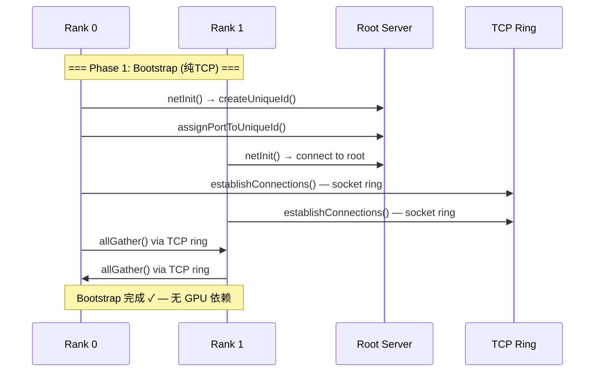
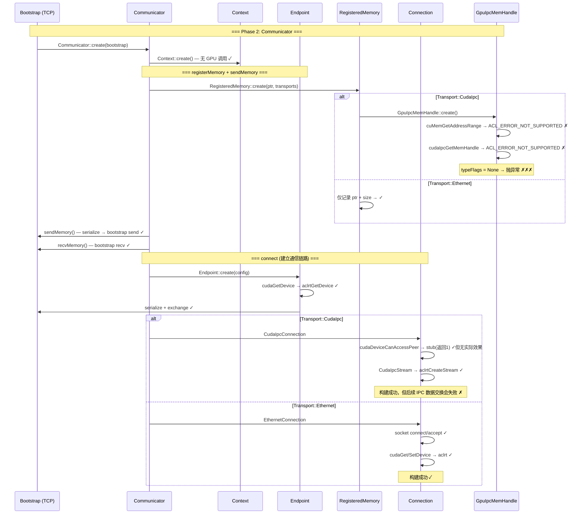

# Bootstrap & Communicator 初始化流程分析（CANN 兼容性评估）

## 分析日期：2026-06-01

## 1. 结论

**TcpBootstrap 本身可以走完** — 纯 TCP/socket，零 GPU 依赖。

**但 bootstrap 之后建立通信链路时有三个致命缺口：**

| 传输类型 | CANN 能走？ | 原因 |
|---------|-----------|------|
| Ethernet | 能（极慢） | 所有 GPU 调用走 aclrt wrapper，数据经 CPU 中转 socket |
| CudaIpc | **不能** | `cudaIpcGetMemHandle` 等 stub 返回 `ACL_ERROR_NOT_SUPPORTED`，`GpuIpcMemHandle::create` 得到 `typeFlags=None` |
| IB0-IB7 | **不能** | CMake 强制 `MSCCLPP_USE_IB=OFF` |

## 2. Bootstrap 初始化时序图



## 3. Communicator 初始化时序图（含 CANN 状态标注）



## 4. 各步骤 CANN 兼容性详细表

### Phase 1: TcpBootstrap

| 步骤 | 文件:行号 | GPU调用 | CANN状态 |
|------|-----------|---------|---------|
| Constructor | bootstrap.cc:147 | 无 | ✓ |
| createUniqueId | bootstrap.cc:131 | 无 | ✓ |
| initialize | bootstrap.cc:164 | 无 | ✓ |
| allGather | bootstrap.cc:454 | 无 | ✓ |
| barrier | bootstrap.cc:570 | 无 | ✓ |
| send/recv | bootstrap.cc:560 | 无 | ✓ |

### Phase 2: Communicator

| 步骤 | 文件:行号 | GPU调用 | CANN状态 |
|------|-----------|---------|---------|
| Communicator::create | communicator.cc:40 | 无 | ✓ |
| registerMemory (CudaIpc) | registered_memory.cc:42 | GpuIpcMemHandle::create | ✗ typeFlags=None |
| registerMemory (Ethernet) | registered_memory.cc:51 | 无 | ✓ |
| sendMemory | communicator.cc:86 | serialize only | ✓ |
| recvMemory (CudaIpc) | registered_memory.cc:114 | GpuIpcMem::create | ✗ throw "type is None" |
| recvMemory (Ethernet) | registered_memory.cc:114 | 无 | ✓ |
| connect (CudaIpc) | context.cc:93 | CudaIpcConnection | ✗ IPC handle broken |
| connect (Ethernet) | context.cc:95 | EthernetConnection | ✓ |

### Phase 3: Connection & Transport

| 步骤 | 文件:行号 | GPU调用 | CANN状态 |
|------|-----------|---------|---------|
| CudaIpcConnection 构建 | connection.cc:85-131 | cudaStreamCreateWithFlags | ✓ (aclrtCreateStream) |
| cudaDeviceCanAccessPeer | connection.cc:113 | stub return ACL_SUCCESS | ✓ 但无效 |
| cudaDeviceEnablePeerAccess | connection.cc:121 | stub return ACL_SUCCESS | ✓ 但无效 |
| EthernetConnection socket | connection.cc:543 | 无 | ✓ |
| EthernetConnection cudaGet/SetDevice | connection.cc:558 | aclrtGet/SetDevice | ✓ |
| EthernetConnection gpuMemcpy | connection.cc:602 | aclrtMemcpy | ✓ |

### Phase 4: GpuIpcMemHandle — 致命缺口

| 步骤 | 文件:行号 | GPU调用 | CANN状态 | 严重性 |
|------|-----------|---------|---------|--------|
| cuMemGetAddressRange | gpu_ipc_mem.cc:159 | ACL_ERROR_NOT_SUPPORTED | ✗ | P0 |
| cudaIpcGetMemHandle | gpu_ipc_mem.cc:171 | ACL_ERROR_NOT_SUPPORTED | ✗ | P0 |
| cuMemRetainAllocationHandle | gpu_ipc_mem.cc:180 | ACL_ERROR_NOT_SUPPORTED | ✗ | P1 |
| cuMemExportToShareableHandle | gpu_ipc_mem.cc:189 | ACL_ERROR_NOT_SUPPORTED | ✗ | P1 |
| GpuIpcMem::create(typeFlags=None) | gpu_ipc_mem.cc:277 | throw exception | ✗✗✗ | P0 |

## 5. 核心缺口与灵衢替代方案

根据 `.opencode/plans/cuda-to-cann-migration-v2.md` 第 4 节和 `migration-diagrams.md` 图3的分析：

### CUDA IPC → OBMM 共享内存

```
CUDA 流程:
  cudaIpcGetMemHandle → exchange → cudaIpcOpenMemHandle

灵衢替代:
  obmem_export_memory(len=4MB_aligned) → {token_id, uba}
  exchange token_id + uba via Bootstrap
  obmem_import_memory(token_id, uba) → mmap'd VA
  peerMems[rank] = mmap'd VA → kernel 直接读写
```

### 最简可行路径

1. **先用 Ethernet transport 跑通全流程**（能走但慢）
2. **并行开发 CANN IPC transport**（基于 OBMM + peerMems[]）
3. **添加防护**：C++/Python API 在 CANN 构建下拒绝 CudaIpc 和 IB transport