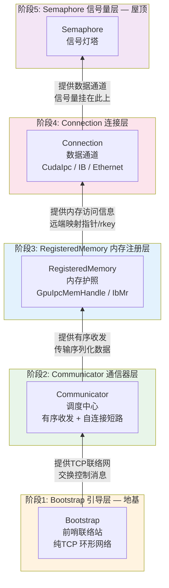
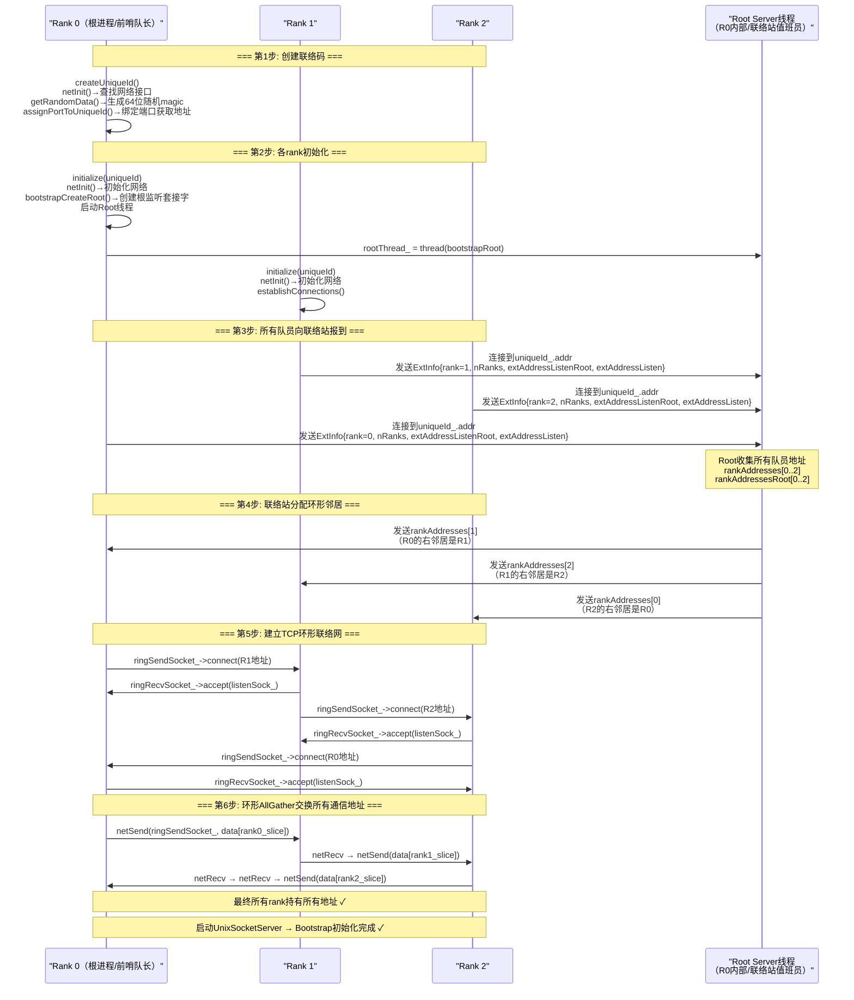
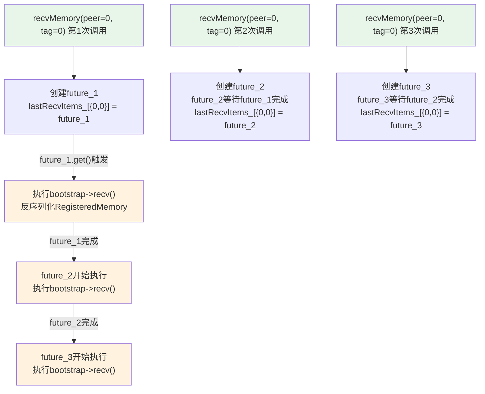
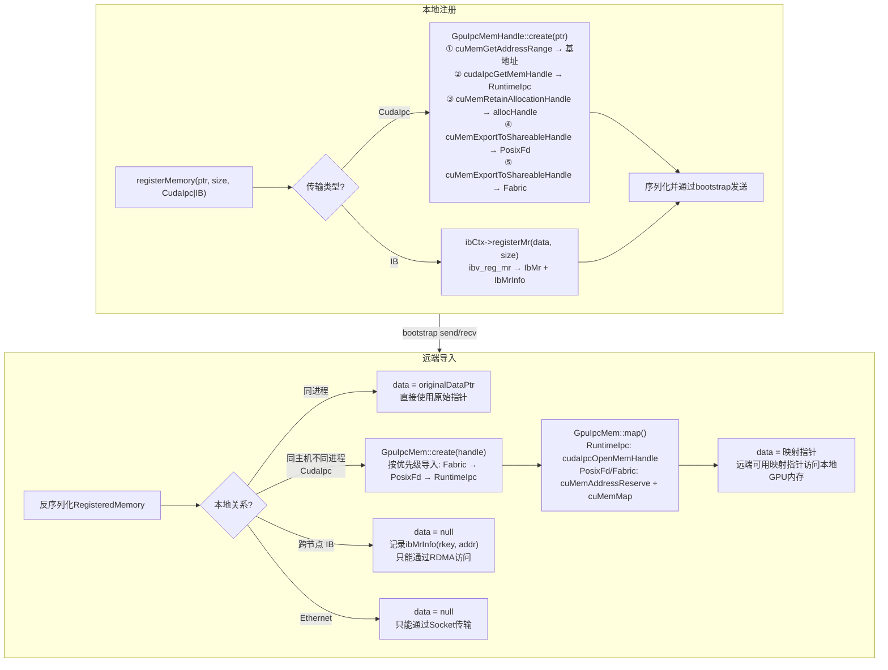
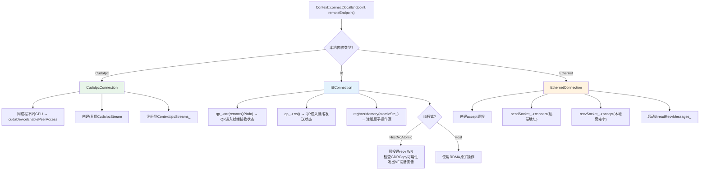
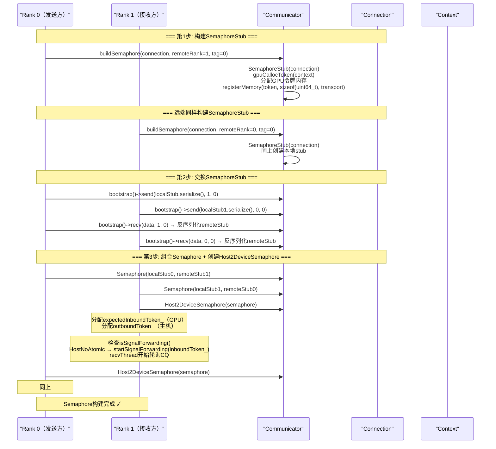
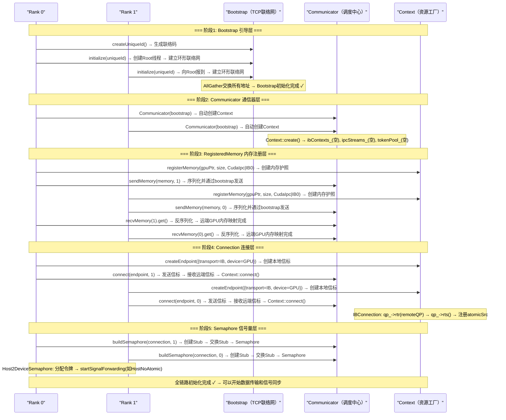

# MSCCL++ 初始化流程架构概览

> 本文档与 `bootstrap-cann-analysis.md` 互补：后者以类图、流程图、时序图、注释详表的形式全景式罗列初始化涉及的每个类和方法；本文档以叙事驱动的方式深度解析初始化的**设计动机、分层哲学和运转机理**，回答"为什么这样设计"而非仅仅"有哪些东西"。建议先读 `bootstrap-cann-analysis.md` 建立组件清单认知，再读本文档理解每个设计决策背后的逻辑。

## 本章导读

MSCCL++ 的初始化不是一个简单的"构造函数调用"，而是一场**从纯 TCP 网络到 GPU 直连的五阶段接力**。读完本章，你将建立三层认知：

1. **是什么**——一套五阶段分层初始化系统：Bootstrap → Communicator → RegisteredMemory → Connection → Semaphore，每阶段解决一个特定层面的问题；
2. **为什么这样设计**——为什么 Bootstrap 不碰 GPU？为什么 RegisteredMemory 要生成三种 IPC 句柄？为什么 Semaphore 有原子模式和转发模式两条路径？每个设计决策都有明确的痛点驱动；
3. **具体怎么运转**——从 Python 代码 `CommGroup.__init__()` 到 GPU 内核拿到 DeviceHandle 的完整追踪链，每一步都有代码锚定。

---

## 1.1 分层架构设计

### What：初始化的分层架构是什么？

MSCCL++ 的初始化分五个阶段，自下而上逐层构建，每层依赖下层完成的基础设施：

```
MSCCL++ 初始化分层架构
├── 阶段1: Bootstrap（引导层）     → 解决"谁是谁"：进程身份识别、地址交换、基础通信通道
├── 阶段2: Communicator（通信器层） → 解决"谁来协调"：引导和上下文的统一入口、有序收发保证
├── 阶段3: RegisteredMemory（内存注册层） → 解决"内存在哪"：GPU/CPU 内存注册、跨进程内存映射
├── 阶段4: Connection（连接层）     → 解决"怎么搬"：CudaIpc/IB/Ethernet 三种传输通道建立
└── 阶段5: Semaphore（信号量层）    → 解决"何时搬"：主机-设备、设备-设备的同步信号机制
```

下面的架构鸟瞰图展示了五阶段的依赖关系——Bootstrap 是地基，Semaphore 是屋顶，每层为上层提供基础设施：



从图中可以看到核心设计：地基（Bootstrap）是纯 TCP、零 GPU 依赖的引导层——它建立的是"身份和地址"，不需要任何 GPU 资源；向上逐层引入 GPU 操作（内存注册→RDMA QP 建立→CUDA IPC 映射→信号灯），但所有上层都扎根在地基的 TCP 环形网络上。这种"先筑地基、逐层加高"的建筑式哲学贯穿整个初始化流程——没有地基，上层全塌；有了地基，上层可以按需建造。

### Why：为什么这样分层？

不分层的系统把所有初始化逻辑塞进一个巨型构造函数——进程身份、内存注册、RDMA 连接、信号量全混在一起。这导致三个问题：

1. **GPU 依赖过早**：如果 Bootstrap 阶段就初始化 GPU，那在没有 GPU 的机器上连进程间基础通信都建不起来。MSCCL++ 的设计目标是"Bootstrap 纯网络，零 GPU"——即使机器没有 GPU，进程也能完成身份识别和地址交换，为后续诊断提供基础设施。

2. **故障隔离困难**：不分层的系统中，RDMA QP 创建失败会连带 Bootstrap 通信崩溃。分层后，每阶段故障被隔离在本层——Bootstrap 崩溃是网络问题，RegisteredMemory 崩溃是 GPU 内存问题，Connection 崩溃是 RDMA/CUDA 驱动问题，调试方向明确。

3. **渐进式资源投入**：不是所有场景都需要五阶段全初始化。纯 CPU 数据传输只需 Bootstrap + Ethernet Connection，无需注册 GPU 内存或建立信号量。分层允许用户按需投入资源——只用需要的层，避免不必要的 GPU 内存注册和 RDMA QP 创建开销。

既然分层解决了"每层干什么"的问题，那么"每层之间怎么交接"就需要明确的接口约定。接下来看各层如何协同。

### How：各层如何协同？

各层之间的协同遵循一个统一的模式：**下层提供通信通道，上层通过序列化-传输-反序列化交接数据**。具体来说：

- **Bootstrap → Communicator**：Bootstrap 提供 `send()/recv()` TCP 通道，Communicator 用它传输 Endpoint、RegisteredMemory、SemaphoreStub 的序列化字节流。
- **Communicator → RegisteredMemory**：Communicator 调用 `Context::registerMemory()` 创建本地内存护照，然后通过 Bootstrap 发送给远端；远端反序列化后完成跨进程内存映射。
- **RegisteredMemory → Connection**：Connection 的 RDMA 写入需要远端 RegisteredMemory 中的 `ibMrInfo`（rkey + addr）；CUDA IPC 拷贝需要远端 RegisteredMemory 中的 `data()` 映射指针。
- **Connection → Semaphore**：Semaphore 的令牌内存通过 Connection 传输信号——Host2Device 用 `updateAndSync()`，Device2Device 用 GPU 原子操作。

理解了分层分工和交接模式后，接下来深入每个组件的内部构造和工作机制。

---

## 1.2 核心组件介绍

### 全局视角与角色类比

在深入每个组件之前，先用一张角色类比表建立直觉——类比对象和组件在**功能角色**上高度相似：

| 组件 | 角色类比 | 核心职责 |
|------|---------|---------|
| **Bootstrap** | 前哨联络站 | 不带任何装备（GPU），只负责让所有队员互相认识、交换联系方式，建立基础联络网 |
| **Communicator** | 调度中心 | 拥有联络网（Bootstrap）和资源工厂（Context），协调"谁把什么发给谁"，保证收发有序 |
| **Context** | 资源工厂 | 持有所有重型装备（IB 上下文、CUDA IPC 流、NVLS 令牌池），按需生产 Endpoint、RegisteredMemory、Connection |
| **Endpoint** | 通信信标 | 一端持有的"联络名片"，可序列化发给远端让对方知道"怎么联系我" |
| **RegisteredMemory** | 内存护照 | 一段内存的"身份证+签证"，包含本地访问地址和远端映射地址，让远端知道"你的货存在哪、怎么取" |
| **Connection** | 数据通道 | 两端信标对接后建成的"运输隧道"，支持三种运输方式（CUDA IPC 快递、RDMA 高速公路、Ethernet 普通道路） |
| **Semaphore** | 信号灯塔 | 挂在通道上的"信号灯"，主机或设备用它通知对方"货到了/可以搬了" |

类比的选择标准是职责相似——Bootstrap 不"搬运数据"但"建立联络"，和前哨联络站的角色吻合；Context 不"通信"但"生产通信资源"，和资源工厂的角色吻合。带着这些直觉，接下来逐个深入。

---

### Bootstrap —— 前哨联络站

#### What：是什么？

Bootstrap 是 MSCCL++ 进程间通信的最低层抽象基类，所有引导实现的接口。它的职责很纯粹：让一组互不相识的进程互相认识、交换地址、建立基础通信通道。

> Bootstrap 核心定义位于 `include/mscclpp/core.hpp`（L29-106），TcpBootstrap 实现位于 `src/core/bootstrap/bootstrap.cc`（619 行）：

```cpp
class Bootstrap {
  virtual int getRank() const = 0;        // 我是谁
  virtual int getNranks() const = 0;       // 我们有多少人
  virtual int getNranksPerNode() const = 0; // 同一节点有多少人
  virtual void send(void* data, int size, int peer, int tag) = 0; // 点对点发送
  virtual void recv(void* data, int size, int peer, int tag) = 0; // 点对点接收
  virtual void allGather(void* allData, int size) = 0;            // 全收集
  virtual void barrier() = 0;                                      // 全局屏障
};
```

TcpBootstrap 是 Bootstrap 的唯一实现，基于纯 TCP 套接字——不碰 GPU、不碰 RDMA、不碰 CUDA。整个 Bootstrap 层的网络开销只有 TCP 连接建立和环形数据交换。

#### 内部结构

```
TcpBootstrap::Impl 内部结构
├── uniqueId_ UniqueIdInternal       → 128字节联络码（随机magic + 套接字地址）
├── rank_, nRanks_, nRanksPerNode_   → 进程身份信息
├── listenSockRoot_ unique_ptr<Socket> → 根服务器监听套接字（仅 rank 0）
├── listenSock_ unique_ptr<Socket>    → 本进程环形监听套接字
├── ringRecvSocket_ unique_ptr<Socket> → 环形左邻居接收套接字
├── ringSendSocket_ unique_ptr<Socket> → 环形右邻居发送套接字
├── peerCommAddresses_ vector<SocketAddress> → 所有进程的通信地址（AllGather 收集）
├── peerSendSockets_ unordered_map<pair<int,int>, shared_ptr<Socket>> → 按{peer,tag}缓存的发送套接字
├── peerRecvSockets_ unordered_map<pair<int,int>, shared_ptr<Socket>> → 按{peer,tag}缓存的接收套接字
├── rootThread_ thread               → 根服务器线程（仅 rank 0 启动）
├── unixSocketServer_ UnixSocketServer → Unix域套接字服务器（用于POSIX FD跨进程传递）
└── abortFlag_ volatile uint32_t*    → 中止标志，用于干净关闭阻塞操作
```

#### Why：为什么 Bootstrap 不碰 GPU？

这是 MSCCL++ 最关键的分层决策。如果把 GPU 操作混入 Bootstrap，会带来三个问题：

1. **环境门槛**：没有 GPU 的机器（比如管理节点、CI 服务器）无法完成 Bootstrap，连最基本的进程间联络都做不到。MSCCL++ 的目标是"Bootstrap 纯网络，零 GPU"——即使没有 GPU，进程也能完成身份识别和地址交换，为后续诊断提供基础设施。

2. **启动速度**：GPU 初始化（CUDA context 创建、内存注册）耗时数百毫秒。如果 Bootstrap 阶段就初始化 GPU，那大规模集群（数千进程）的 Bootstrap 时间会从"秒级 TCP 交换"膨胀到"分钟级 GPU 初始化"。纯 TCP Bootstrap 让大规模集群的联络在几秒内完成。

3. **可替换性**：Bootstrap 是抽象基类，MSCCL++ 提供了 TcpBootstrap，用户也可以实现 MPIBootstrap（基于 MPI_Allgather/MPI_Send/MPI_Recv）——测试代码中就有这样的实现。如果 Bootstrap 依赖 GPU，那 MPIBootstrap 在没有 GPU 的环境就无法使用。

Bootstrap 带来的好处：最低层保持最简约束，任何进程只要能 TCP 通信就能完成引导；后续所有 GPU 相关操作都在更高层按需执行。

#### How：如何工作？

Bootstrap 初始化分六步，下面的时序图展示了三个进程的完整引导过程：



从时序图可以看到几个关键设计：

**Root Server 作为线程而非独立进程**。Rank 0 在自己进程内启动 Root Server 线程，而非用一个独立的根进程。这简化了部署——不需要额外启动一个根服务器，Rank 0 自己就是根。代价是 Rank 0 进程内多了一个线程，但 Bootstrap 完成后根线程就不再活跃（所有连接已建立）。

**环形拓扑而非星形拓扑**。Root Server 只负责"分配邻居地址"，不负责后续所有通信。环形 AllGather 和点对点 send/recv 都通过环形连接完成，Root Server 不参与。这避免了根进程成为瓶颈——大规模集群中，星形拓扑会让根进程承受 nRanks 倍的流量压力。

**按 {peer, tag} 缓存套接字**。Bootstrap 的 `send()/recv()` 不是每次都新建 TCP 连接，而是按 `{peer, tag}` 缓存已建立的套接字。同一个 `{peer, tag}` 的所有消息复用同一个 TCP 连接，减少连接建立开销。不同的 `{peer, tag}` 用不同连接，避免消息流混淆。

**ExtInfo 的双重地址设计**。每个进程向 Root 报到时发送两个地址——`extAddressListenRoot`（给 Root 回调用）和 `extAddressListen`（给环形邻居连接用）。分离的原因是 Root 回调连接和环形连接的生命周期不同：Root 回调是一次性的（Bootstrap 完成后 Root 不再活跃），环形连接是持久的。

理解了前哨联络站的角色后，接下来看它之上的调度中心——Communicator 实现了"有序收发"和"自连接短路"两个关键能力。

---

### Communicator —— 调度中心

#### What：是什么？

Communicator 是 MSCCL++ 初始化的核心协调类，持有 Bootstrap（联络网）和 Context（资源工厂）两个下层依赖，向上提供统一的内存注册、连接建立、信号量构建接口。

> Communicator 核心定义位于 `include/mscclpp/core.hpp`（L805-945），实现位于 `src/core/communicator.cc`（183 行）：

```cpp
class Communicator {
  Communicator(shared_ptr<Bootstrap> bootstrap, shared_ptr<Context> context = nullptr);
  RegisteredMemory registerMemory(void* ptr, size_t size, TransportFlags transports);
  void sendMemory(RegisteredMemory memory, int remoteRank, int tag = 0);
  shared_future<RegisteredMemory> recvMemory(int remoteRank, int tag = 0);
  shared_future<Connection> connect(const EndpointConfig& localConfig, int remoteRank, int tag = 0);
  shared_future<Semaphore> buildSemaphore(const Connection& connection, int remoteRank, int tag = 0);
};
```

#### 内部结构

```
Communicator::Impl 内部结构
├── bootstrap_ shared_ptr<Bootstrap>      → 联络网（下层依赖）
├── context_ shared_ptr<Context>           → 资源工厂（下层依赖，如未提供则自动创建）
├── connectionInfos_ unordered_map<BaseConnection*, ConnectionInfo> → 连接→{remoteRank, tag}映射
├── lastRecvItems_ unordered_map<pair<int,int>, shared_ptr<BaseRecvItem>> → 按{peer,tag}的最近接收项
└── localRecvMemories_ unordered_map<int, list<LocalRecvMemory>> → 本rank向自己发送内存时的暂存
```

#### Why：为什么需要调度中心？

Bootstrap 只提供原始的 `send()/recv()`——你给它字节流和目标 rank，它传输。但实际初始化需要三个 Bootstrap 本身无法解决的问题：

1. **有序收发**：同一 `{peer, tag}` 上，第 i 次发送必须匹配第 i 次接收。如果用户先调用两次 `recvMemory(0, 0)` 再调用两次 `sendMemory(0, 0)`，两次接收必须按序完成。Bootstrap 的 `recv()` 是阻塞的——先到的先完成，无法保证顺序。Communicator 用 `makeOrderedRecvFuture` 创建延迟 future 链：每个 future 等待前一个 future 完成后才执行实际接收，保证顺序。

2. **自连接短路**：当 `remoteRank == self` 时（进程给自己发送内存或建立连接），走 Bootstrap 的 TCP 发送/接收是浪费——数据就在本地，不需要网络传输。Communicator 用 `LocalRecvMemory`（promise/future 机制）直接在进程内传递，跳过网络。同样，自连接时 Communicator 创建两个本地 Endpoint 直接在 Context 内连接，跳过 Bootstrap 交换。

3. **统一入口**：用户不应该分别操作 Bootstrap、Context、Endpoint、RegisteredMemory——这些组件的交互顺序和依赖关系是固定的（先注册内存→再发送→再建立连接→再构建信号量）。Communicator 把固定顺序封装成统一接口，用户只需调用 `registerMemory()` → `sendMemory()/recvMemory()` → `connect()` → `buildSemaphore()`。

Communicator 带来的好处：用户代码不再直接操作 Bootstrap 和 Context，有序性和自连接短路自动处理，初始化流程变成一系列简单的方法调用。

#### How：有序收发如何实现？

`makeOrderedRecvFuture` 是 Communicator 的核心机制，下面的流程图展示了它的运作方式：



从图中可以看到关键设计：所有 future 都用 `std::launch::deferred` 创建——不在新线程上执行，而是在 `.get()` 被调用时才执行。这避免了线程开销，同时保证同一 `{peer, tag}` 上的接收严格按调用顺序完成。

理解了调度中心的角色后，接下来看它依赖的资源工厂——Context 持有所有重型 GPU 资源。

---

### Context —— 资源工厂

#### What：是什么？

Context 是 MSCCL++ 的 GPU 资源管理中心，持有 IB 设备上下文、CUDA IPC 流、NVLS 令牌池等重型资源，按需生产 Endpoint、RegisteredMemory、Connection。

> Context 核心定义位于 `include/mscclpp/core.hpp`（L532-573），内部实现位于 `src/core/include/context.hpp`（51 行）：

```cpp
class Context : public std::enable_shared_from_this<Context> {
  static shared_ptr<Context> create();  // 工厂方法
  RegisteredMemory registerMemory(void* ptr, size_t size, TransportFlags transports);
  Endpoint createEndpoint(EndpointConfig config);
  Connection connect(const Endpoint& localEndpoint, const Endpoint& remoteEndpoint);
};
```

#### 内部结构

```
Context::Impl 内部结构
├── ibContexts_ unordered_map<Transport, unique_ptr<IbCtx>> → IB设备上下文映射（IB0-IB7）
├── ipcStreams_ vector<shared_ptr<CudaIpcStream>>            → CUDA IPC流列表
├── tokenPool_ shared_ptr<TokenPool>                         → NVLS多播令牌池（惰性创建）
├── maxNumTokens_ const size_t = 32768                       → 最大令牌数（2^15）
├── getIbContext(Transport) → IbCtx*                        → 获取或创建IB上下文
└── getToken() → shared_ptr<uint64_t>                        → 获取NVLS令牌
```

#### Why：为什么需要资源工厂？

如果每次创建 Endpoint、RegisteredMemory、Connection 都独立初始化 GPU 资源，会导致两个问题：

1. **重复初始化开销**：同一个 IB 设备的上下文（`IbCtx`）只需创建一次，但每个 IB Endpoint 都需要它。如果每次创建 Endpoint 都重新打开 IB 设备、创建 Protection Domain，那 n 个 Endpoint 就有 n 次 `ibv_open_device()` 调用。Context 的 `ibContexts_` 按 Transport 类型缓存 IB 上下文，只创建一次。

2. **共享资源管理**：CudaIpcConnection 共用同一个 CUDA Stream（同 GPU 设备上所有 IPC 连接共用一个流），NVLS 令牌池管理有限的多播令牌（32K 个）。这些共享资源的生命周期需要跨所有连接统一管理——Context 就是这个统一管理者。

Context 带来的好处：重型 GPU 资源只创建一次、按需复用，初始化开销从 O(n) 降低到 O(1)（对每种 Transport 类型）。

#### How：惰性创建如何工作？

Context 的所有重型资源都是惰性创建的——首次访问时才实例化：

- **IB 上下文**：`getIbContext(IB0)` 首次调用时执行 `ibv_open_device()` + 创建 Protection Domain + 创建 Completion Queue；后续调用直接返回缓存。
- **NVLS 令牌池**：`getToken()` 首次调用时创建 TokenPool（32K 令牌）；后续调用从池中获取。
- **CUDA IPC 流**：CudaIpcConnection 创建时在 Context 的 `ipcStreams_` 中注册；同设备后续连接复用已有流。

惰性创建确保只有实际使用的 Transport 类型才承担初始化开销——只用 Ethernet 的场景不会创建任何 IB 上下文或 CUDA IPC 流。

理解了资源工厂的角色后，接下来看它生产的第一个产品——Endpoint 是通信链路的本地端信标。

---

### Endpoint —— 通信信标

#### What：是什么？

Endpoint 是通信链路的本地端，包含本地传输配置和连接所需的全部信息。它的核心能力是**可序列化**——本地端将 Endpoint 序列化后通过 Bootstrap 发送给远端，远端反序列化后就知道"怎么联系本地端"。

> Endpoint 核心定义位于 `include/mscclpp/core.hpp`（L469-514），实现位于 `src/core/endpoint.cc`（123 行）：

```cpp
class Endpoint {
  const EndpointConfig& config() const;
  Transport transport() const;
  uint64_t hostHash() const;    // 判断是否同一物理主机
  uint64_t pidHash() const;     // 判断是否同一进程
  vector<char> serialize() const;
  static Endpoint deserialize(const vector<char>& data);
};
```

#### 内部结构

```
Endpoint::Impl 内部结构
├── config_ EndpointConfig              → 传输配置（Transport类型 + 设备 + IB详细配置）
├── hostHash_ uint64_t                  → 主机哈希（判断是否同一物理节点）
├── pidHash_ uint64_t                   → 进程ID哈希（判断是否同一进程）
├── [IB专有字段]
│   ├── ibLocal_ bool                   → 是否本地IB（创建时true，远端反序列化后false）
│   ├── ibNoAtomic_ bool                → IB无原子模式标志
│   ├── ibQp_ shared_ptr<IbQp>          → IB队列对（本地创建时持有）
│   └── ibQpInfo_ IbQpInfo              → QP信息（QP号、GID、lid，用于远端QP连接）
├── [Ethernet专有字段]
│   ├── socket_ unique_ptr<Socket>       → TCP监听套接字
│   └── socketAddress_ SocketAddress     → 套接字地址
└── abortFlag_ volatile uint32_t*        → 中止标志
```

#### Why：为什么用"信标交换"而非"连接直建"？

直接建立 RDMA 连接需要两端同时操作——本地端创建 QP，远端也创建 QP，双方交换 QP 信息后才能修改 QP 状态为 RTR/RTS。这不是一次操作能完成的，而是三步：

1. 本地端创建 QP → 序列化 QP 信息发给远端
2. 远端创建 QP → 序列化 QP 信息发给本地端
3. 双方各用对方的 QP 信息修改自己的 QP 状态

Endpoint 把这三步中的前两步封装为"信标交换"——本地端创建 Endpoint（包含 QP 或 Socket），序列化发给远端；远端同样创建 Endpoint，序列化发给本地端。第三步（QP 状态修改）在 `Context::connect()` 中完成。这种"先交换信标、再对接连接"的模式让连接建立变成对称操作——两端执行相同的代码，只是角色互换。

Endpoint 带来的好处：连接建立的复杂步骤被封装为"创建信标→交换信标→对接连接"三个清晰步骤，用户只需调用 `connect()` 一次，内部自动完成三步。

#### How：信标如何创建和交换？

Endpoint 创建根据传输类型有三种路径：

**IB Endpoint**（最复杂）：
1. 解析 IB 模式（Default/Host/HostNoAtomic）——来自配置或环境变量 `MSCCLPP_IBV_MODE`
2. 检查 RDMA 原子支持能力；不支持则自动回退 HostNoAtomic
3. 解析 GID 索引——来自配置或环境变量 `MSCCLPP_IB_GID_INDEX`
4. 通过 `contextImpl.getIbContext(transport)->createQp(...)` 创建 QP
5. 存储 `ibQpInfo_`（QP 号、port、lid、gid、MTU）供序列化

**Ethernet Endpoint**：
1. 通过 `FindInterfaces()` 查找可用网络接口
2. 创建 TCP 套接字，bindAndListen
3. 存储 `socketAddress_` 供序列化

**CudaIpc Endpoint**（最简单）：
1. 仅获取当前 GPU 设备 ID（`cudaGetDevice()`）
2. 无需创建任何网络资源——CUDA IPC 连接在 Connection 阶段建立

理解了通信信标后，接下来看它服务的对象——RegisteredMemory 是一段内存的"护照"。

---

### RegisteredMemory —— 内存护照

#### What：是什么？

RegisteredMemory 是一段已注册到 Context 的内存区域的封装，包含本地访问地址、原始指针、大小、支持的传输类型、以及每种传输类型的具体信息（IPC 句柄或 IB MR）。它的核心能力也是**可序列化**——本地端将 RegisteredMemory 序列化后通过 Bootstrap 发送给远端，远端反序列化后获得远端内存的访问能力。

> RegisteredMemory 核心定义位于 `include/mscclpp/core.hpp`（L578-620），实现位于 `src/core/registered_memory.cc`（198 行）：

```cpp
class RegisteredMemory {
  void* data() const;              // 可访问的指针（本地=原始指针，远端=映射指针）
  void* originalDataPtr() const;   // 注册时的原始指针
  size_t size() const;             // 内存大小
  TransportFlags transports() const; // 支持的传输类型
  vector<char> serialize() const;
  static RegisteredMemory deserialize(const vector<char>& data);
};
```

#### 内部结构

```
RegisteredMemory::Impl 内部结构
├── data void*                          → 可访问指针（本地=原始指针，远端=映射指针）
├── originalDataPtr void*               → 注册时的原始指针值
├── size size_t                         → 内存大小
├── hostHash uint64_t                   → 主机哈希
├── pidHash uint64_t                    → 进程ID哈希
├── transports TransportFlags           → 支持的传输类型集合
├── transportInfos vector<TransportInfo> → 每种传输的具体信息
│   ├── [CudaIpc]: GpuIpcMemHandle      → GPU IPC内存句柄（RuntimeIpc + PosixFd + Fabric）
│   ├── [IB0-IB7]: IbMrInfo             → IB内存注册信息（addr + rkey）
├── localGpuIpcMemHandle UniqueGpuIpcMemHandle → 本地创建的GPU IPC句柄
├── remoteMemMap shared_ptr<void>       → GpuIpcMem::map()返回的映射指针
└── ibMrMap unordered_map<Transport, unique_ptr<IbMr>> → IB内存注册映射
```

#### Why：为什么需要三种 IPC 句柄？

GpuIpcMemHandle 是 RegisteredMemory 中最复杂的部分——一段 GPU 内存同时生成三种 IPC 句柄（RuntimeIpc、PosixFd、Fabric）。这看起来是冗余的，实际上是对 CUDA IPC API 演进历史和硬件拓扑多样性的适配：

1. **RuntimeIpc**（`cudaIpcGetMemHandle`）：最传统的 CUDA IPC 句柄，通过 `cudaIpcOpenMemHandle` 导入。限制是只能映射整个 `cudaMalloc` 分配基地址，不支持虚拟内存 API 的精确映射。但它在所有 CUDA 版本上可用，是兜底方案。

2. **PosixFd**（`cuMemExportToShareableHandle(POSIX_FD)`）：基于 CUDA 虚拟内存 API 的句柄，通过 `cuMemImportFromShareableHandle` + `cuMemMap` 导入。优势是支持精确映射（只映射需要的部分），但需要跨进程传递 POSIX 文件描述符——MSCCL++ 用 `UnixSocketServer` 实现 FD 传递。

3. **Fabric**（`cuMemExportToShareableHandle(FABRIC)`）：NVIDIA IMEX 服务提供的句柄，专为 MNNVL（Multi-Node NVLink）和 NVLink 网络设计。Fabric 句柄可以跨节点传递，让 CudaIpc 传输突破同节点限制——但需要 IMEX daemon 运行。

三种句柄的优先级是 Fabric > PosixFd > RuntimeIpc。远端反序列化时按优先级尝试导入——Fabric 成功就用 Fabric，失败则回退 PosixFd，再失败回退 RuntimeIpc。这确保在任何 CUDA 版本和硬件拓扑上都有可用的导入路径。

#### How：内存护照如何创建和远端导入？

本地注册和远端导入是 RegisteredMemory 的两个核心操作，下面的流程图展示了完整路径：



从图中可以看到几个关键设计：

**同进程短路**：如果发送方和接收方在同一进程（`hostHash && pidHash` 匹配），`data` 直接设为 `originalDataPtr`——无需任何 IPC 映射或 RDMA 操作。这是零开销的自访问路径。

**CudaIpc 回退链**：Fabric 句柄需要 IMEX daemon，PosixFd 需要虚拟内存 API 支持——不是所有环境都满足条件。回退链确保在任何 CUDA 版本上都有可用的导入路径。最终兜底是 RuntimeIpc——它有基地址映射的浪费，但保证可用。

**跨节点 data=null**：IB 和 Ethernet 传输的远端内存无法在本地直接访问（RDMA 需要远端 rkey，Ethernet 需要 Socket 传输），所以 `data=null`。这不是设计缺陷，而是物理限制——跨节点 GPU 内存无法映射到本地地址空间（除非有 MNNVL）。

理解了内存护照后，接下来看它服务的运输隧道——Connection 是两端信标对接后建成的数据通道。

---

### Connection —— 数据通道

#### What：是什么？

Connection 是两个进程间的通信连接，包装 `BaseConnection` 的具体实现（CudaIpc/IB/Ethernet），提供统一的 `write()`、`updateAndSync()`、`flush()` 接口。

> Connection 核心定义位于 `include/mscclpp/core.hpp`（L622-681），三种实现位于 `src/core/connection.cc`（717 行）：

```cpp
class Connection {
  void write(RegisteredMemory dst, uint64_t dstOffset, RegisteredMemory src, uint64_t srcOffset, uint64_t size);
  void updateAndSync(RegisteredMemory dst, uint64_t dstOffset, uint64_t* src, uint64_t newValue);
  void flush(int64_t timeoutUsec = -1);
  Transport transport() const;      // 本地传输类型
  Transport remoteTransport() const; // 远端传输类型
};
```

#### 内部结构（三种实现对比）

```
CudaIpcConnection 内部结构（同节点GPU直连）
├── stream_ shared_ptr<CudaIpcStream>  → CUDA异步流
├── write() → cudaMemcpyAsync(D2D)     → GPU设备间内存拷贝
├── updateAndSync() → cudaMemcpyAsync(H2D) → 主机到设备8字节写入
└── flush() → cudaStreamSynchronize    → 流同步刷新

IBConnection 内部结构（跨节点RDMA）
├── qp_ weak_ptr<IbQp>                → IB队列对（弱引用，生命周期由Endpoint管理）
├── atomicSrc_ unique_ptr<uint64_t>    → 原子操作源内存
├── atomicSrcMem_ RegisteredMemory     → 原子源已注册内存
├── ibNoAtomic_ bool                   → 是否无原子模式
├── gdrSignalForwarding_ bool          → GDRCopy信号转发标志
├── recvThread_ thread                 → HostNoAtomic模式的CPU接收线程
├── signalAddr_ uint64_t               → 信号转发目标地址
├── signalGdrMap_ unique_ptr<GdrMap>   → GDRCopy BAR1映射
├── write() → RDMA Write              → 直接写入远端GPU内存
├── updateAndSync() → Atomic Add / WRITE_WITH_IMM → 两种信号模式
└── flush() → CQ Poll                 → 轮询发送完成队列

EthernetConnection 内部结构（TCP Socket回退）
├── sendSocket_ unique_ptr<Socket>     → 发送套接字
├── recvSocket_ unique_ptr<Socket>     → 接收套接字
├── threadRecvMessages_ thread         → 接收消息线程
├── sendBuffer_ vector<char> (256MB)   → 发送缓冲区
├── recvBuffer_ vector<char> (256MB)   → 接收缓冲区
├── write() → GPU→CPU→Socket→CPU→GPU  → 四步搬运
├── updateAndSync() → Socket消息      → 发送原子更新消息
└── flush() → No-op                   → TCP已保证可靠交付
```

#### Why：为什么 IB 有两种信号模式？

IBConnection 的 `updateAndSync()` 有两种实现：**原子模式**（RDMA Atomic Add）和**无原子模式**（WRITE_WITH_IMM + GDRCopy 转发）。这源于硬件能力的差异：

**原子模式**：NIC 直接对远端 GPU 内存执行 RDMA Atomic Add——CPU 写一个 64 位值到远端内存，GPU 可以直接读到。这是最理想的路径：CPU 一条指令，NIC 直接操作远端 GPU 内存，GPU 无需任何额外操作。

但 RDMA 原子操作有两个硬件前提：
1. NIC 必须支持 RDMA Atomic（不是所有 IB NIC 都支持）
2. IB 内存注册必须允许原子访问（`IBV_ACCESS_REMOTE_ATOMIC`）

**无原子模式**：当硬件不支持原子操作时（比如某些 ConnectX NIC 的 VF 模式），MSCCLPP 回退到 WRITE_WITH_IMM 方案：
1. CPU 发送 0-byte WRITE_WITH_IMM，携带 32 位立即数（imm_data）
2. 远端 NIC 收到后产生完成队列事件
3. 远端 IBConnection 的 recvThread 轮询 CQ，取出 imm_data
4. recvThread 通过 GDRCopy BAR1 映射将信号写入远端 GPU 内存

这条路径比原子模式多了一步 CPU 参与（recvThread），但保证在无原子硬件上也能工作。GDRCopy 是 NVIDIA 提供的 GPU Direct RDMA（GDR）辅助库，允许 CPU 通过 PCIe BAR1 空间直接写 GPU 内存——绕过 CUDA API，延迟只有几百纳秒。

#### How：三种连接如何建立？

Connection 建立在 Endpoint 交换之后，`Context::connect()` 根据本地传输类型分发到三种实现：



从图中可以看到一个关键设计——**IB QP 的生命周期由 Endpoint 管理，Connection 持有弱引用**。QP 在 `createEndpoint()` 时创建，在 `connect()` 时修改状态为 RTR/RTS。Connection 持有 `weak_ptr<IbQp>`，而非 `shared_ptr`——因为 QP 的生命周期应与 Endpoint（代表本地端资源）一致，而非与 Connection（代表逻辑连接）一致。如果 Connection 持有 `shared_ptr<IbQp>`，Connection 销毁后 QP 可能仍然存活，浪费资源。

理解了数据通道后，接下来看挂在通道上的信号灯塔——Semaphore 解决"何时搬"的同步问题。

---

### Semaphore —— 信号灯塔

#### What：是什么？

Semaphore 是 MSCCL++ 的进程间同步机制，挂在一个 Connection 上，让一端通知另一端"数据准备好了/操作完成了"。它有三种具体类型，适配不同的信号路径：

> Semaphore 核心定义位于 `include/mscclpp/semaphore.hpp`（123 行），设备端句柄位于 `include/mscclpp/semaphore_device.hpp`（143 行）：

```cpp
class Host2DeviceSemaphore {     // 主机通知设备
  void signal();                  // CPU端调用，通知远端GPU
  DeviceHandle deviceHandle();    // GPU端使用的扁平结构
};

class Host2HostSemaphore {        // 主机通知主机
  void signal();                  // CPU端调用，通知远端CPU
  bool poll();                    // CPU端轮询
  void wait(int64_t maxSpinCount);// CPU端等待
};

class MemoryDevice2DeviceSemaphore { // 设备通知设备
  DeviceHandle deviceHandle();     // GPU端使用的扁平结构
};
```

#### 内部结构

```
Semaphore 构建过程
├── SemaphoreStub（本地端信标）
│   ├── connection_ Connection     → 挂在哪个连接上
│   ├── token_ shared_ptr<uint64_t> → 信号令牌内存（GPU或CPU分配）
│   ├── idMemory_ RegisteredMemory → 令牌内存的护照（注册+序列化）
│   └── device_ Device             → 令牌所在设备
├── SemaphoreStub交换 → 通过bootstrap发送/接收
└── Semaphore（本地+远端stub组合）
    ├── localStub_ SemaphoreStub   → 本地令牌
    └── remoteStubMemory_ RegisteredMemory → 远端令牌的护照

Host2DeviceSemaphore 内部结构（主机→设备信号）
├── semaphore_ Semaphore           → 信号量核心
├── inboundToken_ shared_ptr<uint64_t> → 入站令牌（仅HostNoAtomic时分配）
├── expectedInboundToken_ UniqueGpuPtr<uint64_t> → 期望令牌（GPU内存）
├── outboundToken_ unique_ptr<uint64_t> → 出站令牌（主机内存）
└── signal() → connection().updateAndSync(remoteMemory, 0, outboundToken_, value+1)

Host2HostSemaphore 内部结构（主机→主机信号）
├── semaphore_ Semaphore
├── expectedInboundToken_ unique_ptr<uint64_t> → 期望令牌（主机内存）
├── outboundToken_ unique_ptr<uint64_t> → 出站令牌（主机内存）
└── poll() → atomicLoad(inboundToken, memory_order_acquire) > expectedInboundToken_

MemoryDevice2DeviceSemaphore 内部结构（设备→设备信号）
├── semaphore_ Semaphore
├── expectedInboundToken_ UniqueGpuPtr<uint64_t> → 期望令牌（GPU内存）
└── signal() → GPU内核执行 red.release.sys.global.add.u64 [remoteInboundToken], 1
```

#### Why：为什么信号量有两种路径而非一种？

Semaphore 的 Host2Device 类型有两条信号路径——**原子路径**和**转发路径**，对应 IBConnection 的两种模式：

**原子路径**（IB Host 模式 / CudaIpc 模式）：
- CPU 调用 `signal()` → `updateAndSync()` → RDMA Atomic Add 或 cudaMemcpyAsync(H2D) 直接写远端 GPU 内存
- GPU 内核轮询 `inboundToken`（指向 SemaphoreStub 的令牌内存，NIC 原子写入的目标）
- 纯硬件路径：CPU → NIC/GPU → GPU，GPU 到 GPU 无 CPU 参与

**转发路径**（IB HostNoAtomic 模式）：
- CPU 调用 `signal()` → `updateAndSync()` → 0-byte WRITE_WITH_IMM（32 位 imm_data）
- 远端 recvThread 轮询 CQ 取出 imm_data → GDRCopy BAR1 写入 `inboundToken_`（额外分配的 GPU 内存）
- GPU 内核轮询 `inboundToken_`（recvThread 写入的目标）
- 混合路径：CPU → NIC → CPU recvThread → GDRCopy BAR1 → GPU，有一步 CPU 参与

两条路径的存在是因为硬件能力差异——有 RDMA 原子支持的 NIC 用原子路径（更快），没有的用转发路径（兼容）。MSCCL++ 的设计是"最优路径优先，兼容路径兜底"，不是"一条路径通用"。

#### How：信号量如何构建和使用？

信号量构建分三步——创建 SemaphoreStub、交换、组合成 Semaphore。下面的时序图展示了两端对称构建 Host2DeviceSemaphore 的完整过程：



从时序图可以看到关键设计——**SemaphoreStub 的令牌内存分配**：

- **NVLS 可用时**：令牌从 Context 的 TokenPool（32K 令牌池）获取，使用 NVLS 多播内存——这是 NVIDIA NVLink Sharp 的硬件多播机制，令牌可以在多个 GPU 间多播。
- **NVLS 不可用时**：令牌通过 `gpuCallocShared<uint64_t>()` 分配普通 GPU 内存——CUDA 分配 + `cudaIpcGetMemHandle`，跨进程通过 IPC 映射访问。

两种分配方式的选择也是"最优优先、兼容兜底"——NVLS 多播令牌支持硬件级多播（信号一次到达多个 GPU），普通令牌只能点对点。

---

## 1.3 初始化全链路时序追踪

前面的组件介绍建立了每个组件的内部认知，但初始化不是孤立组件的堆砌，而是五个阶段的接力。下面的完整时序图追踪了从 Bootstrap 到 Semaphore 的全链路，展示所有阶段如何衔接：



从完整时序图可以看到一个贯穿始终的模式——**每个阶段都通过 Bootstrap 的 TCP 通道交换控制消息**。Bootstrap 建立的环形联络网不仅用于 Bootstrap 自身的 AllGather 和 Barrier，还被 Communicator 在阶段3-5 中用于交换 RegisteredMemory、Endpoint、SemaphoreStub 的序列化数据。Bootstrap 是初始化的"基础设施"，后续所有阶段都是"基础设施上的建筑"。

---

## 1.4 从用户代码看初始化路径

### Python 层：CommGroup 的完整初始化

MSCCL++ 的 Python 包装层提供了 `CommGroup` 类，封装了完整的初始化流程。下面的代码展示了一个典型的使用场景：

```python
import mscclpp

# 步骤1: 创建Bootstrap
comm_group = mscclpp.CommGroup(interfaceIpPortTrio="eth0:192.168.1.1:5000")
# 内部流程:
#   bootstrap = CppTcpBootstrap.create(rank, size)
#   rank == 0: uniq_id = bootstrap.create_unique_id()
#   MPI_Bcast / torch.distributed.broadcast 传递联络码
#   bootstrap.initialize(uniq_id)

# 步骤2: Communicator自动创建
# 内部流程: communicator = CppCommunicator(bootstrap) → Context::create()

# 步骤3: 注册内存 + 交换
tensor = torch.randn(1024, 1024, device="cuda")
connections = comm_group.make_connection(all_ranks, endpoints_config)
local_mem, remote_mems = comm_group.register_tensor_with_connections(tensor, connections)
# 内部流程:
#   registerMemory(tensor.data_ptr(), size, transport)
#   sendMemory / recvMemory → bootstrap传输序列化数据
#   远端: deserialize → GpuIpcMem::create → map → 映射指针

# 步骤4: 建立连接
# make_connection 内部:
#   createEndpoint(config) → 本地信标
#   connect(endpoint, remoteRank) → 发送+接收+对接

# 步骤5: 构建信号量
semaphores = comm_group.make_semaphores(connections)
# 内部流程:
#   buildSemaphore(connection, remoteRank) → Stub → 交换 → Semaphore
#   Host2DeviceSemaphore(semaphore) → 分配令牌 → signalForwarding
```

### C++ 层：测试引擎的完整初始化

MSCCL++ 的 C++ 测试代码展示了更底层的初始化序列：

```cpp
// 步骤1: Bootstrap
auto bootstrap = std::make_shared<mscclpp::TcpBootstrap>(rank, worldSize);
mscclpp::UniqueId id;
if (rank == 0) id = bootstrap->createUniqueId();
MPI_Bcast(&id, sizeof(id), MPI_BYTE, 0, MPI_COMM_WORLD);
bootstrap->initialize(id);

// 步骤2: Communicator + Context
auto communicator = std::make_shared<mscclpp::Communicator>(bootstrap);
// 内部: Context::create() 自动执行

// 步骤3: 注册内存 + 交换
auto localMem = communicator->registerMemory(gpuPtr, size, mscclpp::Transport::CudaIpc);
for (int r = 0; r < worldSize; r++) {
  if (r != rank) {
    communicator->sendMemory(localMem, r);
    remoteMems.push_back(communicator->recvMemory(r));
  }
}

// 步骤4: 连接
for (int r = 0; r < worldSize; r++) {
  if (r != rank) {
    auto connFuture = communicator->connect(transport, r);
    connections.push_back(connFuture.get());
  }
}

// 步骤5: 信号量
for (auto& [r, conn] : connections) {
  auto semFuture = communicator->buildSemaphore(conn, r);
  semaphores.push_back(std::make_shared<Host2DeviceSemaphore>(semFuture.get()));
}
```

从代码追踪可以看到关键观察——**Python 层和 C++ 层的初始化序列完全一致**，只是 Python 层用 `CommGroup` 封装了细节。Nanobind 绑定层（`python/csrc/core_py.cpp`）在关键阻塞操作上释放 GIL（`nb::call_guard<nb::gil_scoped_release>()`），确保 Python 主线程在 Bootstrap 初始化期间不会被阻塞。

---

## 1.5 核心设计模式

### PIMPL 模式（编译防火墙）

MSCCL++ 的所有核心类（TcpBootstrap、Communicator、Context、Endpoint、RegisteredMemory、Semaphore、SemaphoreStub）都使用 PIMPL（Pointer to Implementation）模式——公开头文件只暴露类声明和 `unique_ptr<Impl> pimpl_`，实现细节藏在内部头文件和 `.cc` 文件中。

**为什么**：MSCCL++ 是一个被其他项目（如 MSCCL、Python 绑定）链接的库。PIMPL 保证公开头文件的 ABI 稳定——即使内部实现完全重构，只要公开接口不变，链接方无需重新编译。没有 PIMPL，添加一个内部成员就会改变类大小，破坏 ABI 兼容性。

**具体实现**：Endpoint 和 RegisteredMemory 使用 `shared_ptr<Impl>` 而非 `unique_ptr<Impl>`——因为这些对象可能被多个持有者共享（远端 Endpoint 在 Connection 和 Semaphore 中都需要存活）。TcpBootstrap 使用 `unique_ptr<Impl>`——因为只有一个持有者。

### 惰性初始化（Lazy Initialization）

Context 的所有重型 GPU 资源（IB 上下文、CUDA IPC 流、NVLS 令牌池）都是惰性创建——首次访问时才实例化。

**为什么**：不是所有场景都需要所有 Transport 类型。只用 Ethernet 的场景不应创建 IB 上下文；只用 IB 的场景不应创建 CUDA IPC 流。惰性创建确保只有实际使用的 Transport 类型才承担 GPU 初始化开销。

**具体实现**：`Context::Impl::getIbContext(IB0)` 首次调用时执行 `ibv_open_device()` 并缓存；`getToken()` 首次调用时创建 TokenPool。这些方法都是"查询→不存在→创建→缓存→返回"的模式。

### 有序收发链（Ordered Future Chain）

Communicator 的 `makeOrderedRecvFuture` 创建延迟 future 链，保证同一 `{peer, tag}` 上的接收按调用顺序完成。

**为什么**：Bootstrap 的 `recv()` 是阻塞的——先到的数据先被读取。如果两次 `recvMemory(0, 0)` 的发送方数据到达顺序和调用顺序不一致，两次接收的结果会交叉——第一次 `recvMemory` 可能拿到第二次的数据。有序收发链通过"每个 future 等待前一个完成"解决这个时序问题。

**具体实现**：`lastRecvItems_[{peer, tag}]` 记录最近一个未完成的 recv item；新 recv future 创建时先获取前一个 recv item 的引用，然后用 `std::launch::deferred` 创建延迟 future——future 体中先 `lastRecvItem->wait()`，再执行实际接收。这保证接收严格串行，但没有线程开销（deferred future 在调用者线程上执行）。

### 自连接短路（Self-Connection Shortcut）

当 `remoteRank == self` 时，Communicator 跳过 Bootstrap 网络传输，直接在进程内传递数据。

**为什么**：进程给自己发送内存或建立连接是常见场景（比如 AllReduce 中每个进程既发送又接收自己的数据）。走 Bootstrap 的 TCP 发送/接收是浪费——数据就在本地，不需要网络传输。

**具体实现**：`sendMemory(self)` 用 `LocalRecvMemory`（promise/future 机制）直接传递 RegisteredMemory；`connect(self)` 创建两个本地 Endpoint 直接在 Context 内连接。两者的共同模式是"检测 self → 跳过网络 → 进程内直接传递"。

### 最优路径优先、兼容路径兜底

整个初始化流程贯穿"最优优先、兼容兜底"的设计哲学：

- **GpuIpcMemHandle**：Fabric > PosixFd > RuntimeIpc——Fabric 最快（跨节点 CudaIpc），PosixFd 精确映射，RuntimeIpc 兜底保证可用
- **IB 信号模式**：原子模式 > WRITE_WITH_IMM + GDRCopy——原子模式更快（纯硬件），WRITE_WITH_IMM 兼容无原子硬件
- **NVLS 令牌**：NVLS 多播令牌 > 普通 GPU 分配——NVLS 支持硬件多播，普通分配兼容所有 GPU
- **CudaIpc 回退 IB**：同节点 CudaIpc > 跨节点 IB——CudaIpc 最快（零拷贝 D2D），IB 兼容跨节点

每种选择都不是"通用最优"，而是"场景最优+兜底可用"——保证在任何硬件配置上都有可工作的路径，同时在高端硬件上自动选择最优路径。

---

## 1.6 源码目录导航

```
MSCCL++ 初始化相关源码目录
├── include/mscclpp/                → 公共头文件（ABI稳定接口）
│   ├── core.hpp (L29-945)          → Bootstrap, Communicator, Context, Endpoint, RegisteredMemory, Connection 全部公开接口
│   ├── semaphore.hpp (L1-123)      → Host2Device/Host2Host/MemoryDevice2Device Semaphore 公开接口
│   ├── semaphore_device.hpp (L1-143) → GPU内核使用的DeviceHandle扁平结构
│   └── nvls_device.hpp             → NVLS多播设备端操作
├── src/core/                       → 核心库实现
│   ├── bootstrap/bootstrap.cc (619行) → TcpBootstrap全实现：createUniqueId, initialize, Root Server, 环形连接, AllGather, send/recv
│   ├── bootstrap/socket.cc (753行)    → Socket基础设施：bind, listen, accept, connect, send, recv
│   ├── communicator.cc (183行)        → Communicator全实现：有序收发, 自连接短路, sendMemory, recvMemory, connect, buildSemaphore
│   ├── context.cc (107行)             → Context实现：惰性IB上下文, 惰性令牌池, registerMemory, createEndpoint, connect
│   ├── endpoint.cc (123行)            → Endpoint创建和序列化/反序列化
│   ├── registered_memory.cc (198行)   → RegisteredMemory创建和序列化/反序列化, GpuIpcMemHandle创建
│   ├── connection.cc (717行)          → CudaIpc/IB/Ethernet Connection全实现
│   ├── semaphore.cc (238行)           → SemaphoreStub, Semaphore, 三种信号量实现
│   ├── gpu_ipc_mem.cc (502行)         → GpuIpcMemHandle创建(Fabric/PosixFd/RuntimeIpc), GpuIpcMem导入和映射
│   └── include/                       → 内部头文件（PIMPL实现细节）
│       ├── communicator.hpp (90行)    → Communicator::Impl, RecvItem, LocalRecvMemory, ConnectionInfo
│       ├── context.hpp (51行)         → Context::Impl, CudaIpcStream定义
│       ├── endpoint.hpp (41行)        → Endpoint::Impl定义
│       ├── registered_memory.hpp (61行) → RegisteredMemory::Impl, TransportInfo定义
│       ├── connection.hpp (212行)     → BaseConnection, CudaIpc/IB/Ethernet Connection定义
│       ├── gpu_ipc_mem.hpp (116行)    → GpuIpcMemHandle, GpuIpcMem定义
│       └── serialization.hpp (26行)   → 序列化/反序列化辅助函数
├── python/csrc/                    → Nanobind Python绑定
│   ├── core_py.cpp (333行)         → Bootstrap, Communicator, Endpoint, RegisteredMemory绑定
│   └── semaphore_py.cpp (51行)     → 三种Semaphore绑定, DeviceHandle扁平结构
├── python/mscclpp/                 → Python包装层
│   ├── _core/comm.py (280行)       → CommGroup: 封装完整初始化流程
│   └── __init__.py (132行)         → Cpp前缀→Pythonic名称重命名
└── test/                           → 测试代码
    ├── mp_unit/bootstrap_tests.cc (145行) → Bootstrap多进程测试, MPIBootstrap自定义实现
    ├── mp_unit/communicator_tests.cu (301行) → Communicator全链路测试, Connection+Semaphore使用
    └── mscclpp-test/common.cc (730行)      → 测试引擎: setupMeshConnections完整初始化序列
```

**推荐阅读路径**：

1. `include/mscclpp/core.hpp` → 理解所有公开接口和类型定义
2. `src/core/bootstrap/bootstrap.cc` → 理解Bootstrap全流程（最底层，最关键）
3. `src/core/communicator.cc` → 理解有序收发和自连接短路
4. `src/core/gpu_ipc_mem.cc` → 理解三种IPC句柄的创建和回退链
5. `src/core/connection.cc` → 理解三种连接实现，特别是IB的两种信号模式

---

## 本章总结

MSCCL++ 的初始化是一场从纯 TCP 网络到 GPU 直连的五阶段接力，核心思想是"先建路、再搬货、最后挂信号灯"——Bootstrap 建联络路，RegisteredMemory 注册货在哪，Connection 建运输隧道，Semaphore 挂信号灯。

本章覆盖了三层认知：

1. **是什么**：五阶段分层初始化系统，每层解决一个层面的问题（身份→协调→内存→通道→信号）
2. **为什么**：Bootstrap 不碰 GPU（环境门槛+启动速度+可替换性）；三种 IPC 句柄适配硬件多样性；两种信号路径适配 RDMA 原子能力差异
3. **怎么运转**：从 Python `CommGroup.__init__()` 到 GPU 内核拿到 DeviceHandle 的完整追踪链；每阶段通过 Bootstrap TCP 通道交换序列化控制消息

| 知识点 | 核心要点 |
|--------|---------|
| **五阶段接力** | Bootstrap → Communicator → RegisteredMemory → Connection → Semaphore，先建路再搬货 |
| **Bootstrap 纯 TCP** | 零 GPU 依赖，纯网络联络网，Root Server 作为 Rank 0 内部线程 |
| **有序收发链** | `makeOrderedRecvFuture` 保证同一 `{peer, tag}` 的接收按调用顺序完成 |
| **自连接短路** | `remoteRank == self` 时跳过 Bootstrap 网络，进程内 promise/future 直接传递 |
| **三种 IPC 句柄** | Fabric > PosixFd > RuntimeIpc，最优优先兼容兜底 |
| **IB 两种信号模式** | 原子模式（RDMA Atomic Add）> 无原子模式（WRITE_WITH_IMM + GDRCopy BAR1） |
| **PIMPL 模式** | 所有核心类用 PIMPL 保证 ABI 稳定，Endpoint/RegisteredMemory 用 `shared_ptr<Impl>` |
| **惰性初始化** | IB 上下文、CUDA IPC 流、NVLS 令牌池按需创建，避免不必要的 GPU 开销 |
| **环形拓扑** | Bootstrap AllGather/Barrier 用环形拓扑，避免 Root Server 成为瓶颈 |

---

## 附录：生僻术语速查

| 术语 | 简述 |
|------|------|
| PIMPL | Pointer to Implementation，将类实现细节藏在指针背后的编译防火墙模式 |
| GDRCopy | NVIDIA GPU Direct RDMA Copy 辅助库，允许 CPU 通过 PCIe BAR1 直接读写 GPU 内存 |
| WRITE_WITH_IMM | InfiniBand 0-byte 写入携带 32 位立即数，用于无原子模式的信号传递 |
| MNNVL | Multi-Node NVLink，NVIDIA 的跨节点 NVLink 网络技术 |
| IMEX | NVIDIA Infinity Exchange Service，管理 Fabric 句柄的守护进程 |
| NVLS | NVLink Sharp，NVIDIA 的硬件多播机制，信号可一次到达多个 GPU |
| BAR1 | PCIe Base Address Register 1，GPU 内存映射到 CPU 地址空间的窗口 |
| QP RTR/RTS | InfiniBand Queue Pair 的 Ready-to-Receive / Ready-to-Send 状态 |
| imm_data | InfiniBand 立即数据，32 位数据随 WRITE_WITH_IMM 一起传递 |
| TokenPool | NVLS 多播令牌池，32K 令牌从池中分配，支持硬件级多播信号 |