# MSCCL++ CUDA → CANN 迁移可视化图表

---

## 图1：MSCCL++ 整体架构（CUDA 侧）

```mermaid
graph TB
    subgraph Host["Host CPU"]
        BS["TcpBootstrap"] --> COMM["Communicator"]
        COMM --> CTX["Context"]
        CTX --> RM["RegisteredMemory"]
        CTX --> EP["Endpoint"]
        COMM --> CONN["Connection"]
        
        subgraph CONN_TYPES["Connection Types"]
            CIPC["CudaIpcConnection<br/>cudaMemcpyAsync D2D"]
            IB["IBConnection<br/>RDMA write/atomic"]
            ETH["EthernetConnection<br/>Socket send/recv"]
        end
        
        CONN --> CONN_TYPES
        
        PS["ProxyService"] --> PROXY["ProxyThread"]
        PROXY --> FIFO_HOST["Fifo (host side)<br/>poll/pop triggers"]
        PROXY --> CONN
        
        subgraph IPC["CUDA IPC / VMM"]
            IPC_RT["cudaIpcGetMemHandle<br/>cudaIpcOpenMemHandle"]
            IPC_FD["cuMemExportToShareableHandle<br/>cuMemImportFromShareableHandle<br/>cuMemAddressReserve<br/>cuMemMap<br/>cuMemSetAccess"]
            MC["cuMulticastCreate<br/>cuMulticastAddDevice<br/>cuMulticastBindAddr"]
        end
        
        CTX --> IPC
    end
    
    subgraph GPU["GPU (CUDA)"]
        subgraph Channels["Channel Device Handles"]
            MC_DEV["MemoryChannelDeviceHandle<br/>dst_(IPC ptr) + semaphore"]
            PC_DEV["PortChannelDeviceHandle<br/>FifoDevHandle + semaphore"]
            SC_DEV["SwitchChannelDeviceHandle<br/>devicePtr + mcPtr(multicast)"]
        end
        
        subgraph SEM["Semaphore Types"]
            D2D["MemoryDevice2DeviceSemaphore<br/>PTX red.release.sys.global.add.u64"]
            H2D["Host2DeviceSemaphore<br/>host writes, GPU polls atomicLoad"]
        end
        
        subgraph FIFO_DEV["FifoDeviceHandle"]
            FIFO_PUSH["push()<br/>atomicFetchAdd(head)<br/>st.global.release.sys.v2.u64"]
            FIFO_SYNC["sync()<br/>poll tail update"]
        end
        
        subgraph EK["Execution Kernel"]
            EK_MAIN["executionKernel __global__"]
            EK_SM["14 __shared__ variables<br/>memoryChannels_<br/>portChannels_<br/>nvlsChannels_<br/>buffers_[]<br/>offsets_[]"]
            EK_OPS["Operation Types<br/>PUT/GET/SIGNAL/WAIT<br/>FLUSH/MULTI_LOAD_REDUCE_STORE<br/>BARRIER/PIPELINE"]
        end
        
        MC_DEV --> D2D
        PC_DEV --> H2D
        PC_DEV --> FIFO_DEV
        SC_DEV -->|multimem PTX| GPU
        EK_MAIN --> EK_SM
        EK_SM --> Channels
        EK_OPS --> Channels
    end
    
    IPC_RT -.->|IPC-mapped ptr| MC_DEV
    IPC_FD -.->|VA-mapped ptr| MC_DEV
    MC -.->|multicast VA| SC_DEV
    FIFO_DEV -.->|host-pinned mem| FIFO_HOST
    D2D -.->|GPU atomic write| GPU
```

---

## 图2：MSCCL++ 整体架构（灵衢 CANN 侧 — 目标）

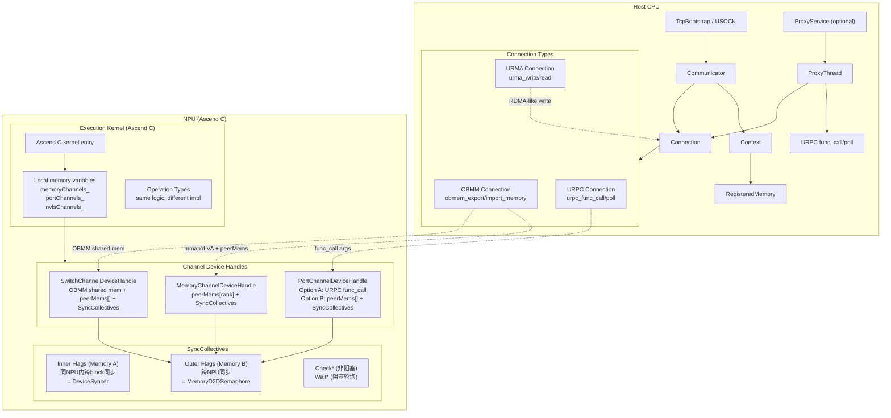

---

## 图3：MemoryChannel 数据流时序图（CUDA vs 灵衢）

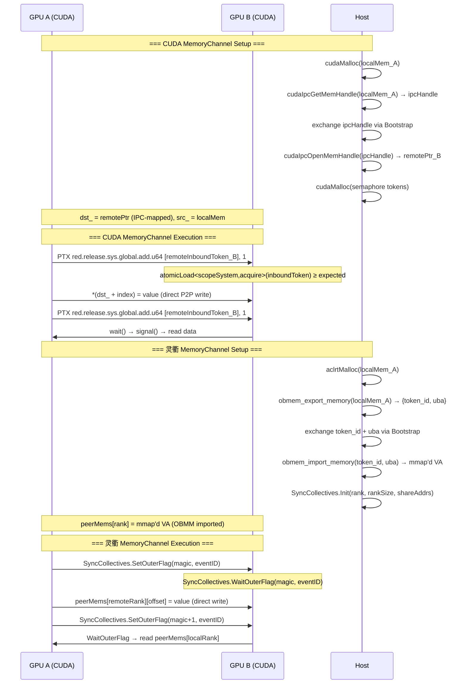

---

## 图4：PortChannel 数据流时序图（CUDA vs 灵衢）

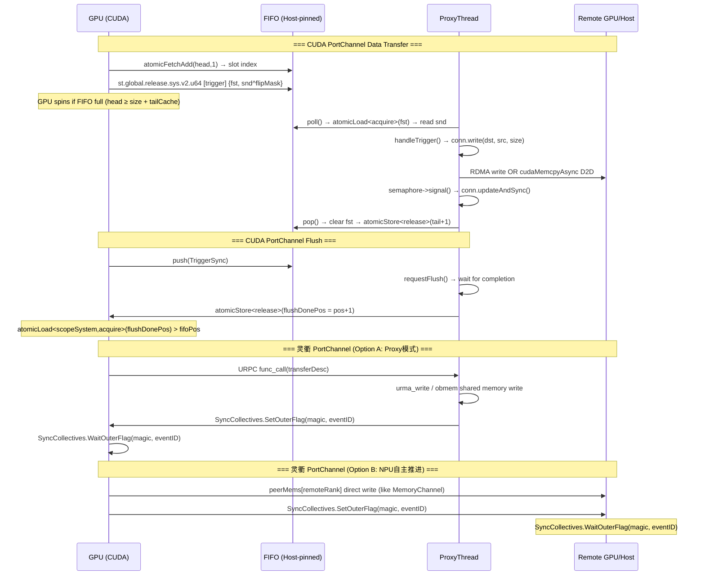

---

## 图5：SwitchChannel 数据流时序图（CUDA vs 灵衢）

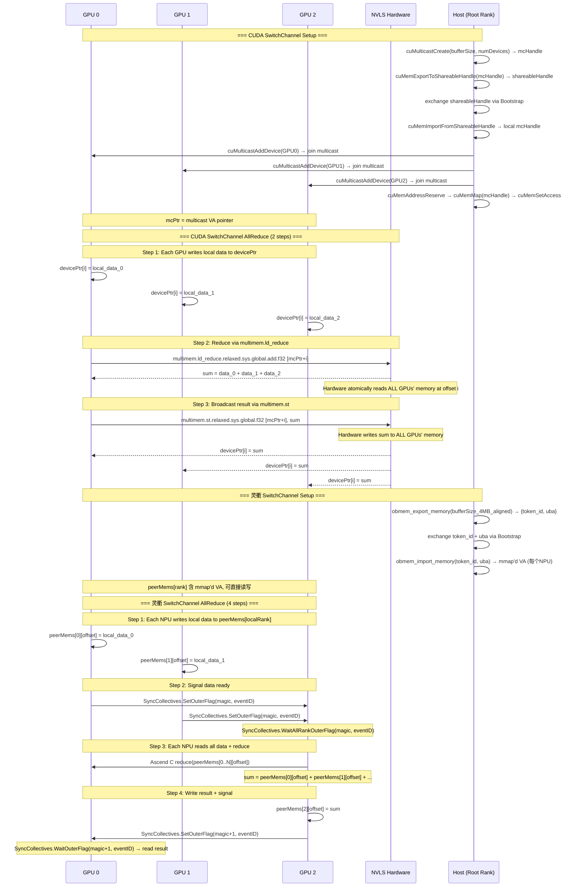

---

## 图6：FIFO 机制详细时序图（CUDA PortChannel 核心）

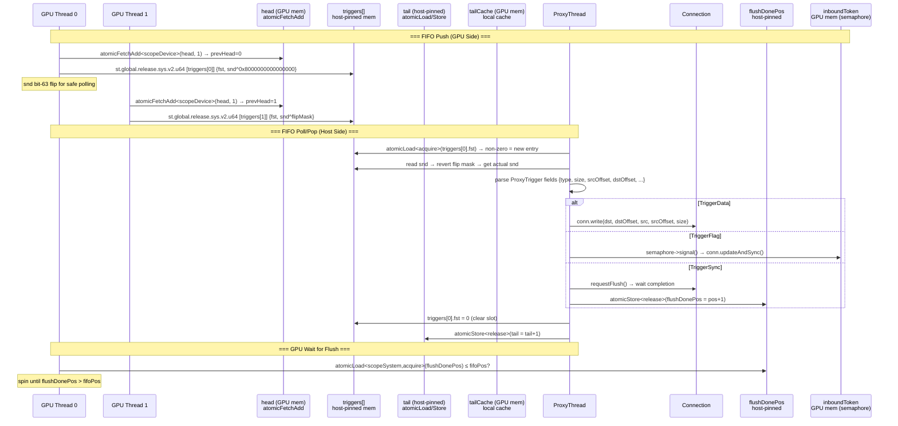

---

## 图7：SyncCollectives 机制详细时序图

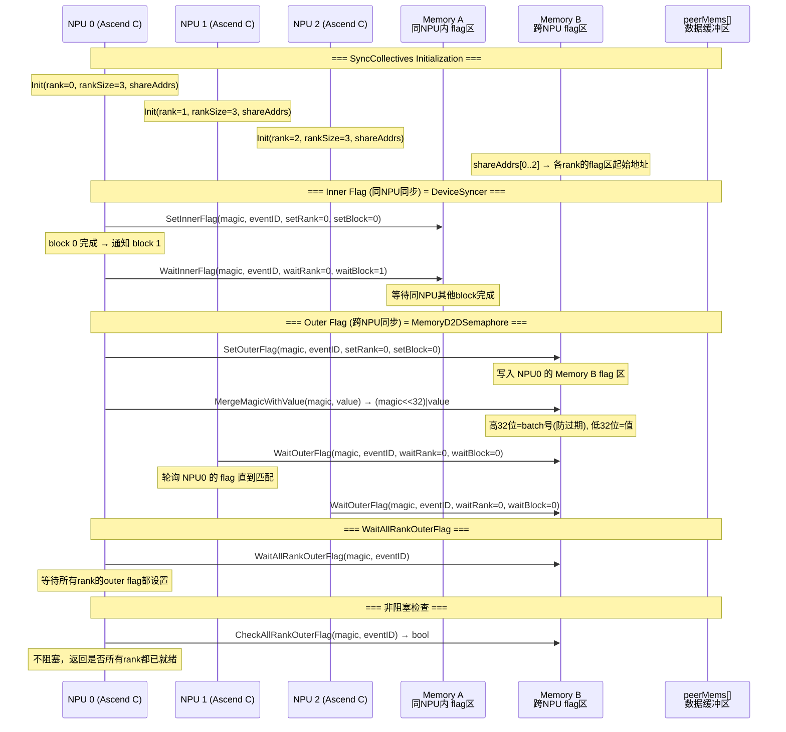

---

## 图8：OBMM 共享内存机制流程图

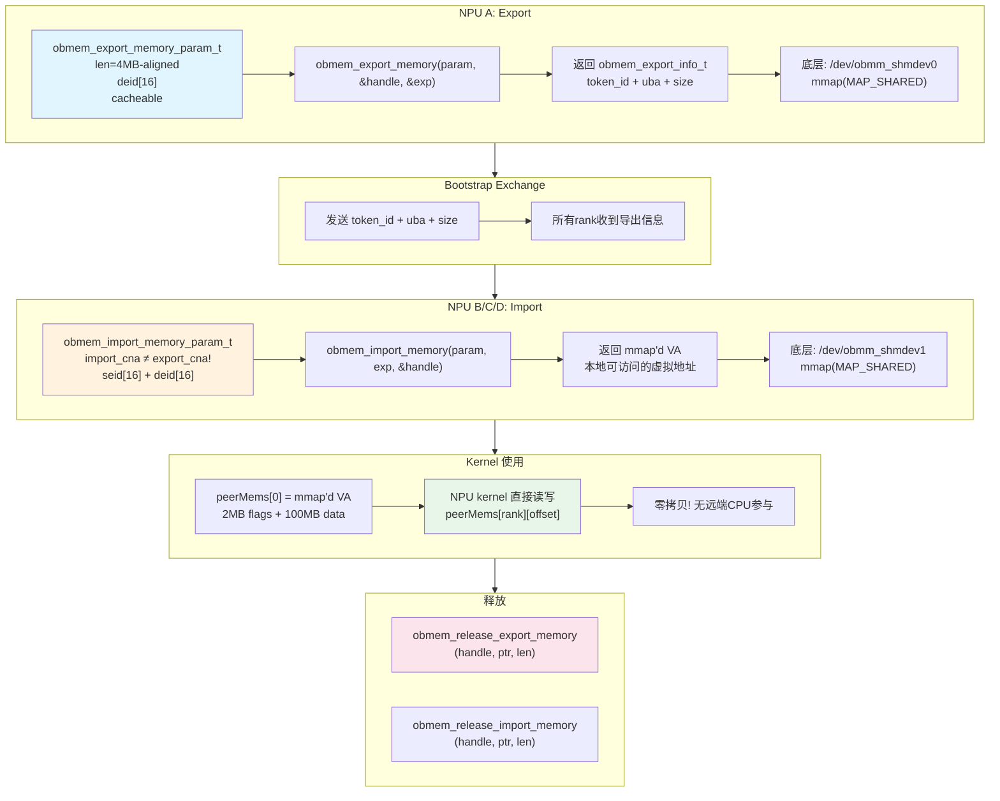

---

## 图9：AIV Kernel 加载和执行管线

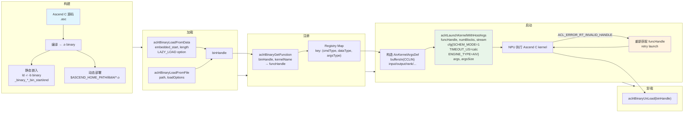

---

## 图10：executionKernel Operation 处理流程图

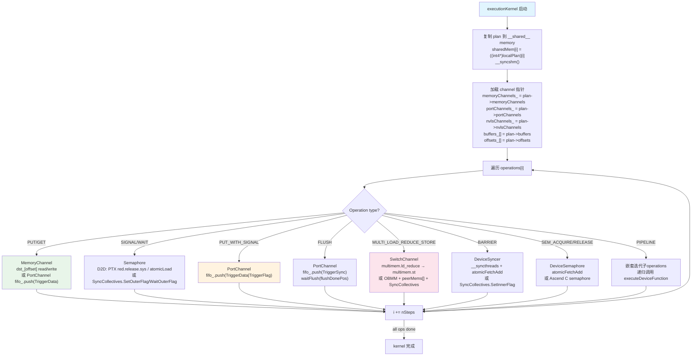

---

## 图11：迁移优先级依赖图

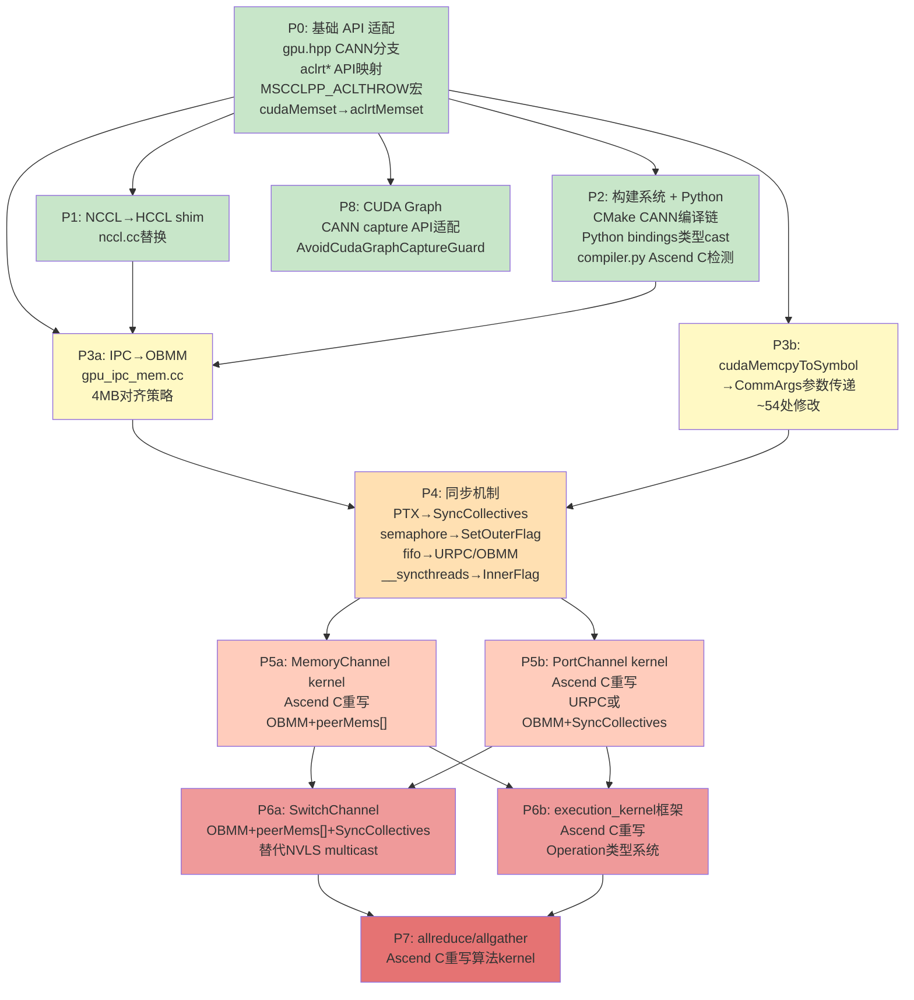

---

## 图12：CUDA API 依赖层次图（从底层到上层）

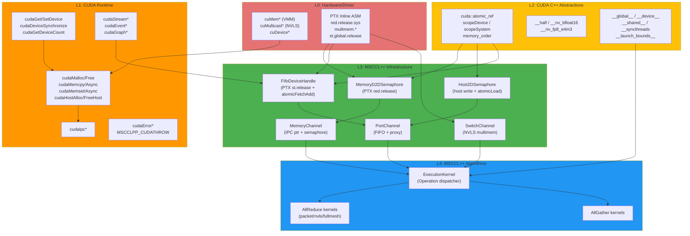

---

## 图13：灵衢替代 API 依赖层次图

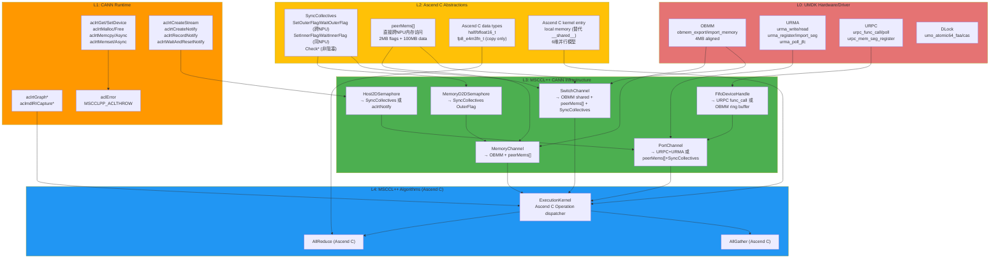

---

## 图14：CUDA vs 灵衢 对比矩阵（需求完整性检查）

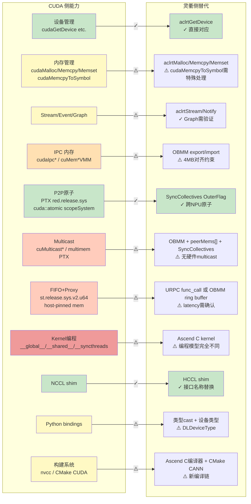

---

## 图15：GDRCopy / IB HostNoAtomic 模式时序图（CUDA 特有细节）

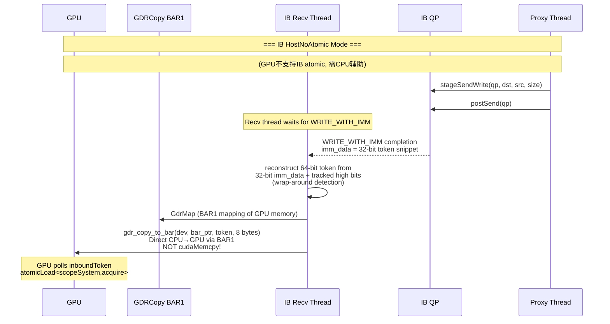

---

## 需求完整性自检清单

基于以上图表，检查是否有遗漏的需求：

| 检查项 | 状态 | 说明 |
|--------|------|------|
| 设备管理 API 全覆盖 | ✓ | 图14 显示所有 cudaDevice* 已映射 |
| 内存管理 API 全覆盖 | ✓ | 新增 cudaMemset/cudaMemcpyToSymbolAsync |
| Stream/Event/Graph 全覆盖 | ✓ | 新增 CUDA Graph API 整个类别 |
| IPC 机制全覆盖 | ✓ | OBMM 替代，含 4MB 对齐约束 |
| 跨 NPU 原子操作 | ✓ | SyncCollectives OuterFlag + DLock atomic |
| Multicast 替代 | ✓ | OBMM + peerMems[] + SyncCollectives（图5） |
| FIFO+Proxy 替代 | ✓ | URPC 或 OBMM ring buffer（图4） |
| Kernel 编程模型 | ✓ | Ascend C 6维并行（图8、10） |
| Semaphore 替代 | ✓ | SyncCollectives Outer/Inner（图7） |
| execution_kernel 框架 | ✓ | Operation 类型系统全覆盖（图10） |
| NCCL shim | ✓ | HCCL API 映射 |
| Python bindings | ✓ | 类型 cast + 编译器检测 |
| 构建系统 | ✓ | CMake + compiler.py |
| GDRCopy 特殊路径 | ✓ | 图15 覆盖 IB HostNoAtomic 模式 |
| AIV kernel 管线 | ✓ | 图9 覆盖加载→注册→启动 |
| OBMM 4MB 对齐 | ✓ | 图8 标注对齐要求 |
| bit-63 flip 协议 | ✓ | 图6 FIFO 详细时序 |
| flushDonePos 机制 | ✓ | 图6 FIFO flush 流程 |
| magic/value 合并 | ✓ | 图7 SyncCollectives 详细 |
| Memory A vs B 区分 | ✓ | 图7 Inner vs Outer flags |
| URMA 完整 API | ✓ | 图13 层次图覆盖 |
| DLock atomic | ✓ | 图13 包含 umo_atomic64 |
| URPC RPC | ✓ | 图13 包含 func_call/poll |
| **PTX→灵衢映射** | ✓ | 图3/4/5/6 覆盖所有 PTX 指令 |
| **CUDA error codes** | ⚠️ | 需建立完整 aclError 映射表 |
| **aclrtGraph 确认** | ⚠️ | 需验证 CANN Graph API 可用性 |
| **URMA from NPU kernel** | ⚠️ | 需确认 NPU kernel 内能否调用 URMA |
| **CANN peer access** | ⚠️ | cudaDeviceCanAccessPeer 的 CANN 对应未确认 |