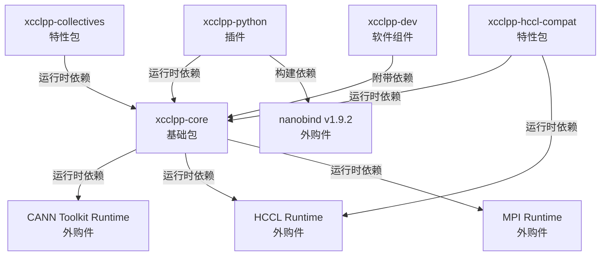
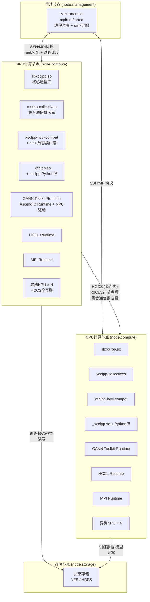

# XCCL++ — 部署视图

> 功能设计说明书 · 部署视图 · V1

## 本章导读

本章描述XCCL++（MSCCL++迁移到CANN昇腾计算架构后的产品）的系统部署方案，包含交付模型和部署模型两个子视图。交付模型定义系统的offering构成、构建元素打包方式、版本与升级策略；部署模型定义构建元素到部署节点的映射关系和部署规则。读完本章，评审人员应能回答：系统交付了什么、怎么安装、装在哪里、各组件之间如何依赖。

---

## 1 交付模型

### 1.1 Offering总览

参照MSCCL++原有构建产物结构，XCCL++定义以下5个offering：

| Offering | 类型 | 说明 |
|----------|------|------|
| xcclpp-core | 基础包 | 核心通信库，包含Channel/Semaphore/Proxy/Bootstrap等基础设施 |
| xcclpp-python | 插件 | Python绑定与Python层DSL接口 |
| xcclpp-collectives | 特性包 | 集合通信算法实现（AllReduce、AllGather等） |
| xcclpp-hccl-compat | 特性包 | HCCL兼容接口层，允许现有HCCL应用无缝替换 |
| xcclpp-dev | 软件组件 | 开发辅助包，含头文件、cmake配置、示例代码 |

### 1.2 各Offering构建元素

#### 1.2.1 xcclpp-core（基础包）

| 构建元素 | 类型 | 产出路径 | 说明 |
|---------|------|---------|------|
| libxcclpp.so | 共享库 | build/lib/ | 核心通信库动态链接版本，被用户程序dlopen或LD_LIBRARY_PATH加载 |
| libxcclpp_static.a | 静态库 | build/lib/ | 核心通信库静态链接版本，用于嵌入式场景或需要完全静态链接的用户 |
| xcclpp公共头文件集 | 头文件包 | include/xcclpp/*.hpp | core.hpp、channel/device头文件、semaphore.hpp等API接口定义 |

**版本策略**：跟随XCCL++主干版本号（MAJOR.MINOR.PATCH），独立patch版本用于紧急修复。

**交付策略**：源码编译交付（cmake），要求目标机器具备CANN Toolkit开发环境。可选提供预编译rpm/deb包。

**升级策略**：整包升级，API层向后兼容，内部实现可自由演进。静态库升级需用户重新链接。

#### 1.2.2 xcclpp-python（插件）

| 构建元素 | 类型 | 产出路径 | 说明 |
|---------|------|---------|------|
| _xcclpp.so | Python扩展模块 | python/csrc/产出 | nanobind生成的C++→Python绑定模块 |
| xcclpp Python包 | Python包 | python/xcclpp/ | 包含core/、ext/、language/、utils.py，Python层DSL与高层API |

**版本策略**：跟随core版本号，wheel包版本通过setuptools-scm从git自动生成。

**交付策略**：pip wheel包交付，支持`CMAKE_ARGS`传入cmake编译参数。

**升级策略**：pip install --upgrade，依赖core共享库版本匹配。

#### 1.2.3 xcclpp-collectives（特性包）

| 构建元素 | 类型 | 产出路径 | 说明 |
|---------|------|---------|------|
| 集合通信算法库 | 共享库/静态库 | build/lib/ | AllReduce、AllGather、Broadcast等集合通信算法的CANN实现 |

**版本策略**：独立版本号，可滞后于core版本发布。

**交付策略**：源码编译交付，通过cmake选项`XCCLPP_BUILD_EXT_COLLECTIVES=ON`控制是否构建。

**升级策略**：可独立升级，声明对core版本的依赖范围（>=x.y.z）。

#### 1.2.4 xcclpp-hccl-compat（特性包）

| 构建元素 | 类型 | 产出路径 | 说明 |
|---------|------|---------|------|
| HCCL兼容接口层 | 共享库/静态库 | build/lib/ | 提供HCCL API签名的兼容实现，内部调用xcclpp-core |

**版本策略**：独立版本号，跟随HCCL API版本演进。

**交付策略**：源码编译交付，通过cmake选项`XCCLPP_BUILD_EXT_HCCL_COMPAT=ON`控制是否构建。

**升级策略**：可独立升级，依赖core版本 + HCCL Runtime版本。

#### 1.2.5 xcclpp-dev（软件组件）

| 构建元素 | 类型 | 产出路径 | 说明 |
|---------|------|---------|------|
| cmake配置文件 | 配置文件 | build/lib/cmake/xcclpp/ | cmake find_package支持文件 |
| version.hpp | 生成头文件 | include/xcclpp/ | 从version.hpp.in + VERSION文件生成 |
| 示例代码 | 文档/代码 | examples/ | C++与Python使用示例 |

**版本策略**：跟随core版本号，不独立发布。

**交付策略**：随core包附带，不单独交付。

**升级策略**：跟随core升级。

### 1.3 Offering依赖关系

**依赖方式说明**：

| 依赖关系 | 方式 | 版本约束 |
|---------|------|---------|
| core → CANN Toolkit | 运行时动态链接 | >= CANN 7.0（抽象描述，具体版本待定） |
| core → HCCL | 运行时动态链接 | 跟随CANN Toolkit版本 |
| core → MPI | 运行时动态链接 | OpenMPI >= 4.x 或 mpich >= 3.x |
| python → core | 运行时dlopen加载共享库 | core版本须精确匹配 |
| collectives → core | 运行时动态链接 | core >= 当前MINOR版本 |
| hccl-compat → core | 运行时动态链接 | core >= 当前MINOR版本 |
| hccl-compat → HCCL | 运行时动态链接 | 跟随CANN Toolkit版本 |
| python → nanobind | 构建时编译依赖 | = 1.9.2 |

### 1.4 外购件清单

| 外购件 | 交付方 | 交付形式 | 版本约束 | 说明 |
|--------|-------|---------|---------|------|
| CANN Toolkit | 华为 | rpm/deb包 + 源码 | >= 7.0.RC1 | 包含Ascend C编译器、NPU驱动、Runtime |
| HCCL | 华为 | 随CANN Toolkit附带 | 跟随CANN版本 | 华为集合通信库，作为底层基础设施 |
| MPI (OpenMPI/mpich) | 开源社区 | 源码编译/包管理器 | >= 4.x (OpenMPI) / >= 3.x (mpich) | 控制面Bootstrap依赖 |
| nanobind | 开源社区 | pip包 | = 1.9.2 | Python C++绑定构建工具 |

---

## 2 部署模型

### 2.1 部署节点定义

| 节点类型 | 说明 | 标识 |
|---------|------|------|
| NPU计算节点 | 昇腾NPU服务器，直接访问NPU硬件，运行集合通信逻辑 | `node.compute` |
| 管理节点 | 运行MPI调度、rank分配，不直接访问NPU | `node.management` |
| 存储节点 | 提供训练数据/模型的共享存储，不参与集合通信 | `node.storage` |

### 2.2 构建元素到部署节点的映射

#### 2.2.1 NPU计算节点（node.compute）

| 构建元素 | 部署路径 | 部署形式 | 说明 |
|---------|---------|---------|------|
| libxcclpp.so | /usr/local/lib | 共享库 | 运行时核心库，被用户程序动态链接 |
| libxcclpp_static.a | 开发环境 | 静态库 | 仅开发时部署，生产环境可选 |
| xcclpp-collectives 库 | /usr/local/lib | 共享库 | 集合通信算法，按需加载 |
| xcclpp-hccl-compat 库 | /usr/local/lib | 共享库 | HCCL兼容层，按需加载 |
| _xcclpp.so | {python-site-packages} | Python扩展 | Python场景使用 |
| xcclpp Python包 | {python-site-packages}/xcclpp | Python包 | Python场景使用 |
| xcclpp公共头文件集 | /usr/local/include/xcclpp | 头文件 | 仅开发环境部署 |
| cmake配置文件 | /usr/local/lib/cmake/xcclpp | 配置文件 | 仅开发环境部署 |
| CANN Toolkit Runtime | /usr/local/Ascend/ascend-toolkit | 外购件 | NPU驱动 + Ascend C运行时 |
| HCCL Runtime | /usr/local/Ascend/hccl | 外购件 | 集合通信基础库 |
| MPI Runtime | /usr/lib | 外购件 | Bootstrap控制面 |

#### 2.2.2 管理节点（node.management）

| 构建元素 | 部署路径 | 部署形式 | 说明 |
|---------|---------|---------|------|
| MPI Daemon (mpirun/orted) | /usr/bin | 可执行文件 | 进程调度与rank分配 |
| xcclpp-core (静态库) | 开发环境可选 | 静态库 | 若管理节点也参与通信则需部署 |

#### 2.2.3 存储节点（node.storage）

| 构建元素 | 部署路径 | 部署形式 | 说明 |
|---------|---------|---------|------|
| 无xcclpp构建元素 | — | — | 存储节点不参与集合通信 |
| NFS/HDFS服务 | /usr/local | 系统服务 | 共享存储服务 |

### 2.3 UML部署图

### 2.4 部署规则

按类别定义软件部署规则，系统中任何构建元素均可根据规则确定其可部署的节点类型：

| 规则编号 | 规则类别 | 规则描述 | 适用构建元素示例 |
|---------|---------|---------|---------------|
| R1 | 通信运行时 | 需直接访问NPU硬件或参与集合通信数据面的构建元素，必须部署在NPU计算节点 | libxcclpp.so, collectives, hccl-compat, Python绑定 |
| R2 | 控制面 | 仅参与进程调度与协调、不直接访问NPU硬件的构建元素，部署在管理节点或NPU计算节点均可 | MPI Daemon |
| R3 | 纯数据面无关 | 不参与集合通信数据面且不访问NPU的构建元素，可部署在任意节点类型 | 无（当前无此类构建元素） |
| R4 | 存储服务 | 仅提供数据存储服务的构建元素，部署在存储节点 | NFS/HDFS服务 |
| R5 | 开发辅助 | 仅用于开发编译环境的构建元素（头文件、cmake配置、静态库），不进入生产部署，仅在开发环境的NPU计算节点上部署 | xcclpp-dev, libxcclpp_static.a, 头文件集, cmake配置 |
| R6 | 外购件运行时 | 外购件的运行时组件跟随其服务对象部署：CANN/HCCL跟随NPU计算节点，MPI跟随需要进程调度的节点 | CANN Toolkit Runtime, HCCL Runtime, MPI Runtime |

**规则适用验证**：

| 构建元素 | 适用规则 | 可部署节点 | 验证结果 |
|---------|---------|---------|---------|
| libxcclpp.so | R1 | NPU计算节点 | 正确 |
| xcclpp-collectives | R1 | NPU计算节点 | 正确 |
| xcclpp-hccl-compat | R1 | NPU计算节点 | 正确 |
| _xcclpp.so + Python包 | R1 | NPU计算节点 | 正确 |
| MPI Daemon | R2 | 管理节点 / NPU计算节点 | 正确 |
| xcclpp公共头文件集 | R5 | 仅开发环境NPU计算节点 | 正确 |
| libxcclpp_static.a | R5 | 仅开发环境NPU计算节点 | 正确 |
| cmake配置文件 | R5 | 仅开发环境NPU计算节点 | 正确 |
| 示例代码 | R5 | 仅开发环境NPU计算节点 | 正确 |
| CANN Toolkit Runtime | R6 | NPU计算节点 | 正确 |
| HCCL Runtime | R6 | NPU计算节点 | 正确 |
| MPI Runtime | R6 | 管理节点 / NPU计算节点 | 正确 |
| NFS/HDFS服务 | R4 | 存储节点 | 正确 |

---

## 本章小结

| 概念 | 要点 |
|------|------|
| Offering数量 | 5个：1基础包 + 1插件 + 2特性包 + 1软件组件 |
| 核心交付物 | libxcclpp.so（共享库）为最小可交付单元 |
| 部署节点类型 | 3类：NPU计算节点、管理节点、存储节点 |
| 部署规则 | 6条规则覆盖所有构建元素的部署判定 |
| 外购件依赖 | 4项：CANN Toolkit、HCCL、MPI、nanobind |
