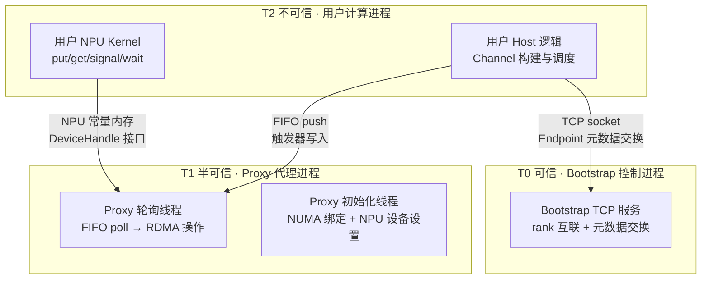
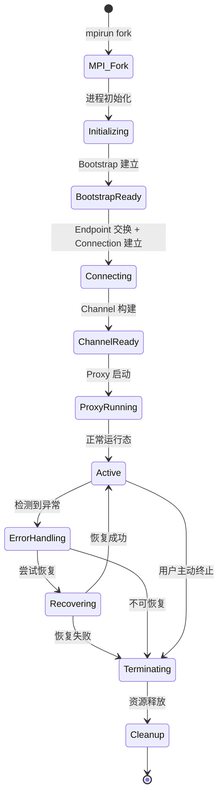
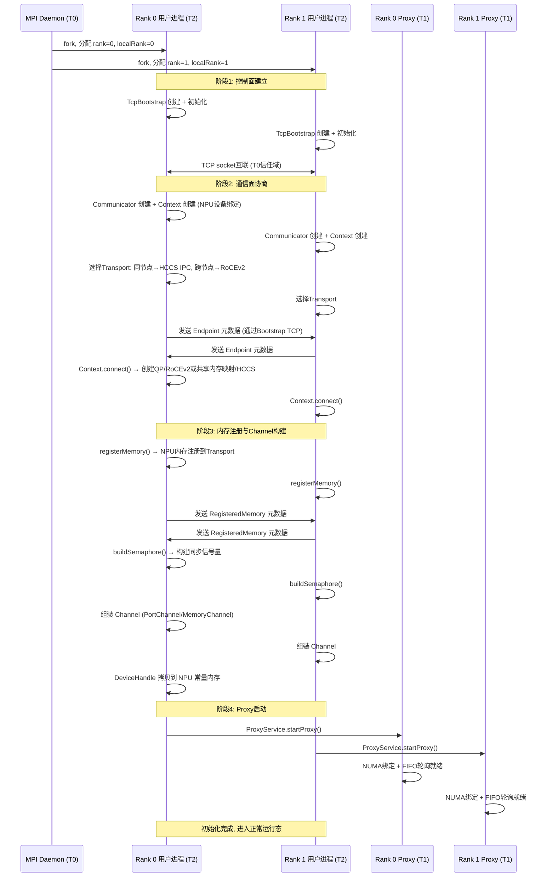
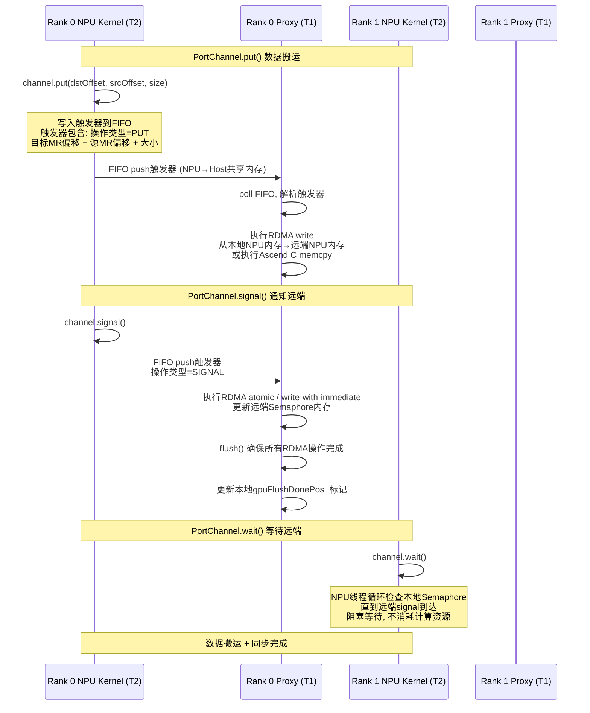
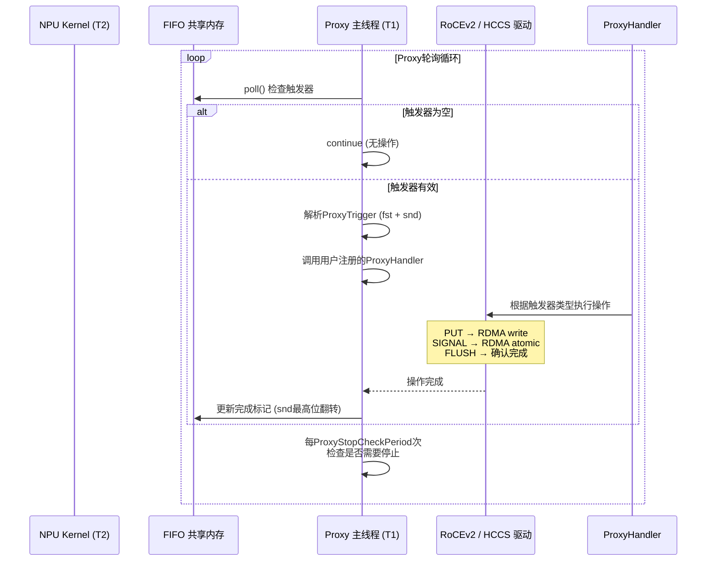
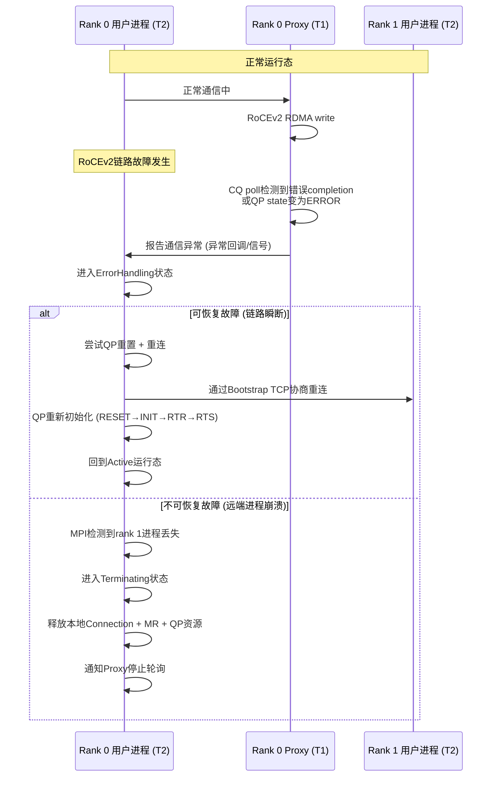
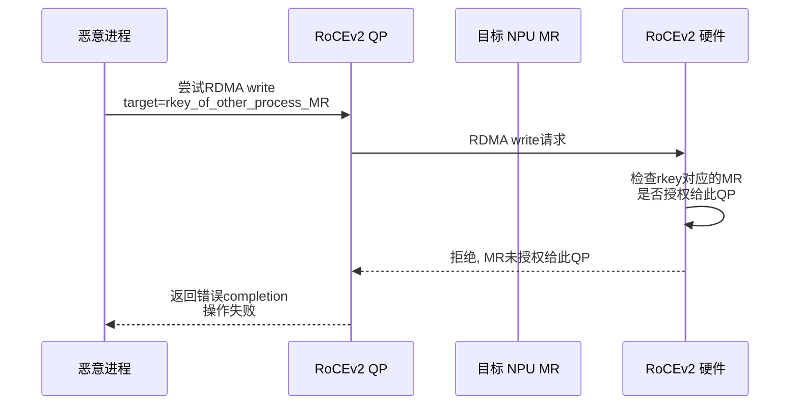
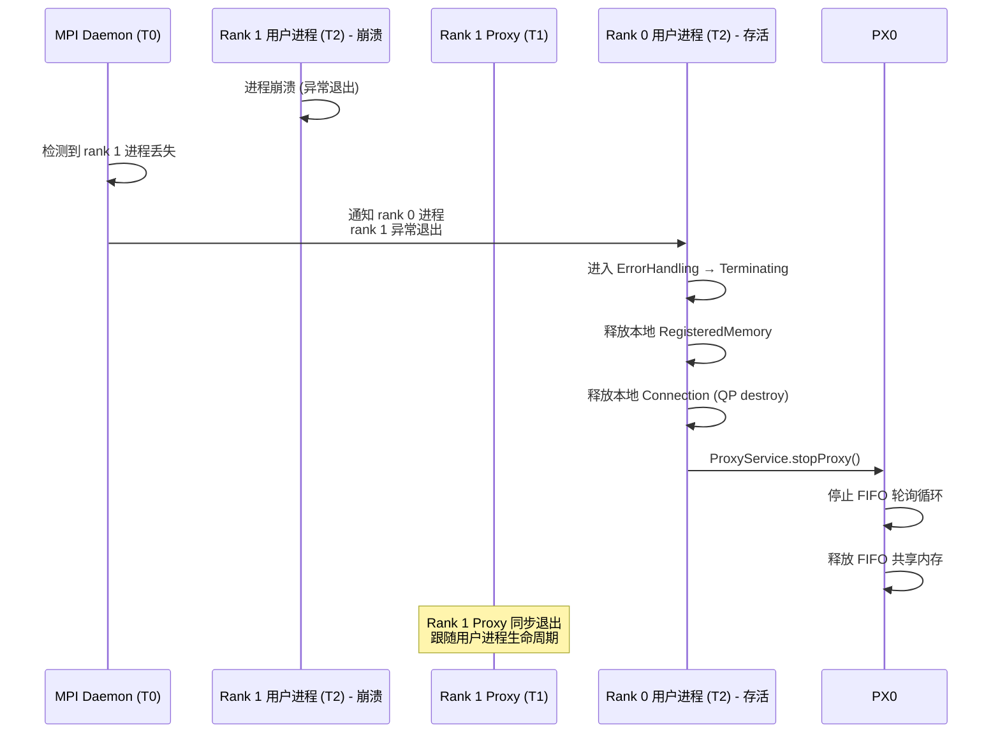

# XCCL++ — 运行视图

> 功能设计说明书 · 运行视图 · V1

## 本章导读

本章描述XCCL++（MSCCL++迁移到CANN昇腾计算架构后的产品）的系统运行模型，覆盖进程线程模型与并发并行设计、运行模型关键因素、运行交互分析和可信重点功能场景四个维度。读完本章，评审人员应能回答：系统运行时有哪些进程和线程、它们如何协作与隔离、关键运行场景的交互路径是什么、系统如何保障安全韧性。

---

## 1 进程线程模型与并发并行设计

### 1.1 进程划分原则与信任等级

进程划分的核心原则是**不同信任等级的实现元素必须用不同进程进行内存隔离**。基于此原则，定义三个信任等级及其对应的进程类型：

| 信任等级 | 定义 | 进程类型 | 内存隔离范围 | 说明 |
|---------|------|---------|------------|------|
| T0（可信） | 系统基础设施，由可信方部署和管控 | Bootstrap控制进程 | 独立地址空间，仅暴露TCP socket接口 | 负责控制面协调，不直接访问NPU硬件资源，不处理用户数据 |
| T1（半可信） | 系统服务组件，由可信方部署但需接触用户数据 | Proxy代理进程 | 独立地址空间，可访问NPU内存的注册区域和RDMA MR | 负责Host端通信代理，需读取FIFO触发器和执行RDMA操作，但不执行用户计算逻辑 |
| T2（不可信） | 用户应用代码，不可预知行为 | 用户计算进程 | 独立地址空间，仅通过Channel DeviceHandle接口访问通信能力 | 用户NPU kernel和Host端逻辑，只能通过xcclpp提供的Channel API发起通信请求 |

**进程边界即隔离边界**的体现：

- T2用户进程无法直接访问T1 Proxy进程的FIFO缓冲区和QP操作句柄——只能通过NPU端写入触发器（signal()），由Proxy读取后执行
- T1 Proxy进程无法直接执行T2用户进程的计算逻辑——只响应FIFO触发器执行预定义的RDMA操作
- T0 Bootstrap进程不访问任何NPU硬件资源——仅通过TCP socket传递Endpoint元数据

### 1.2 线程使用原则

每个进程内部的线程划分遵循以下原则：

**用户计算进程（T2）**：

| 线程 | 角色 | 说明 |
|------|------|------|
| 主线程 | 进程入口 + 通信初始化 | 负责Bootstrap创建、Communicator初始化、Channel构建、ProxyService启动，完成后进入用户计算逻辑 |
| NPU Kernel线程（隐式） | 数据搬运与同步 | 由主线程发起kernel launch，NPU硬件并行执行Channel操作（put/get/signal/wait），无需Host线程介入 |
| 计算线程（可选） | 用户自定义并行计算 | 用户可根据业务需要创建多线程并行计算逻辑，xcclpp不做约束 |

**Proxy代理进程（T1）**：

| 线程 | 角色 | 说明 |
|------|------|------|
| 代理主线程 | FIFO轮询 + RDMA执行 | busy-poll FIFO触发器，解析触发器后执行对应的RDMA write / RDMA atomic / cudaMemcpy等操作 |
| 初始化线程 | 设备与NUMA设置 | 代理启动前执行，绑定NUMA节点和设置NPU设备，确保RDMA操作的内存局部性 |

**Bootstrap控制进程（T0）**：

| 线程 | 角色 | 说明 |
|------|------|------|
| TCP服务线程 | 控制面消息收发 | 处理rank间的send/recv/allGather/barrier请求，纯TCP socket操作 |

### 1.3 并发并行设计

**NPU端并行模型**：

| Channel类型 | 并发模型 | 说明 |
|------------|---------|------|
| MemoryChannel | 多线程并行搬运 | NPU kernel内多个线程同时读写远程NPU内存，适合小消息低延迟场景，带宽随线程数线性增长 |
| PortChannel | 单线程代理驱动 | NPU端单线程写入FIFO触发器，Host端Proxy执行实际数据搬运，适合大消息高带宽场景 |
| SwitchChannel | 混合模型 | 结合MemoryChannel的低延迟和PortChannel的高带宽，按消息大小自适应切换 |

**Host端并发模型**：

- Proxy线程与用户主线程通过FIFO缓冲区（NPU-Host共享内存）通信，无锁设计
- 多个Channel共享同一Proxy线程的FIFO，按触发器到达顺序串行处理
- 可选：用户自定义ProxyService为每个Channel创建独立Proxy线程（高级优化场景）

**跨节点并行模型**：

- 多个rank的Proxy线程各自独立运行，互不干扰
- 同一rank的不同Channel（不同remoteRank/不同Transport）可并行执行
- RoCEv2 QP的send queue和completion queue保证同一QP上的操作有序完成

### 1.4 进程生命周期

---

## 2 运行模型关键因素

### 2.1 资源

| 资源类别 | 管理策略 | 说明 |
|---------|---------|------|
| **NPU内存** | 注册式管理 | 用户通过Communicator.registerMemory()注册内存区域，注册时指定Transport类型（HCCS IPC / RoCEv2），系统在注册时完成物理内存映射或MR注册，不使用中间缓冲区 |
| **RoCEv2 QP资源** | 连接式池化 | 每个Connection创建独立的QP，QP的send_wr/recv_wr/cq大小由EndpointConfig.Ib参数控制，QP资源在Connection析构时释放 |
| **FIFO缓冲区** | 固定大小预分配 | Proxy的FIFO在ProxyService启动时预分配NPU-Host共享内存，大小由fifoSize参数控制（默认值待定），运行时不扩缩 |
| **HCCS共享内存** | 注册式映射 | 节点内NPU间通过HCCS IPC共享内存实现零拷贝通信，注册时建立跨进程映射，通信结束时释放映射 |
| **TCP socket** | Bootstrap生命周期绑定 | Bootstrap控制面的TCP socket在initialize()时创建，进程退出时关闭，不跨Channel复用 |

### 2.2 权限

| 权限对象 | 权限模型 | 说明 |
|---------|---------|------|
| **NPU设备访问** | 进程级设备绑定 | 每个rank进程通过MPI分配的localRank绑定特定NPU设备，Proxy线程继承同一设备绑定，跨设备访问仅通过Channel间接实现 |
| **RDMA MR访问** | 连接级受限访问 | 每个RegisteredMemory的MR仅授权给已建立Connection的QP访问，未建立Connection的QP无法读写该MR，防止越权访问 |
| **共享内存映射** | 注册级进程隔离 | HCCS IPC共享内存仅在两端rank进程间映射，其他进程无法访问映射区域 |
| **FIFO触发器写入** | Channel级接口约束 | T2用户进程只能通过Channel的signal()/push()接口写入FIFO，无法直接操作FIFO的底层内存布局 |

### 2.3 隔离

| 隔离维度 | 隔离机制 | 说明 |
|---------|---------|------|
| **进程级内存隔离** | 操作系统地址空间隔离 | T0/T1/T2三个信任等级的进程各自拥有独立地址空间，T2无法访问T1的FIFO/QP句柄，T1无法访问T0的TCP socket内部状态 |
| **Channel级数据隔离** | Transport + MR绑定 | 每个Channel绑定独立的Connection和RegisteredMemory，不同Channel的数据流互不干扰 |
| **QP访问边界** | RDMA MR rkey+lkey约束 | QP只能访问其Connection协商授权的MR范围，超出MR范围的RDMA操作被硬件拒绝 |
| **NPU设备隔离** | CUDA/HIP设备绑定 | 每个rank绑定固定NPU设备，NPU kernel只能在绑定设备上执行，跨设备操作必须通过Channel |

### 2.4 节能

| 场景 | 策略 | 说明 |
|------|------|------|
| **Proxy轮询节能** | Adaptive poll间隔 | Proxy主线程默认busy-poll，可通过配置切换为sleep-poll模式（周期性检查而非持续轮询），降低CPU功耗。ProxyStopCheckPeriod参数控制检查间隔 |
| **NPU kernel空闲** | Channel wait阻塞 | 当NPU kernel调用Channel.wait()时，该线程阻塞等待远端signal，不消耗计算资源。对MemoryChannel场景，空闲线程不执行内存读写操作 |
| **连接空闲资源** | MR保持 / QP降级 | 长空闲的Connection可选择保持MR注册（低开销）但降低QP的预分配wr数量，减少硬件资源占用 |
| **进程级节能** | Proxy延迟启动 | ProxyService在Channel构建完成后才启动，初始化阶段不消耗Proxy线程资源 |

### 2.5 运行态监控

| 监控对象 | 监控指标 | 监控方式 | 说明 |
|---------|---------|---------|------|
| **Channel状态** | 信号量值、数据搬运量 | NPU端内嵌统计 | Channel的signal/wait计数可用于判断通信是否卡死 |
| **Proxy健康** | FIFO深度、触发器处理速率 | Host端Proxy自检 | Proxy定期检查FIFO是否溢出、处理速率是否异常下降 |
| **NPU内存使用** | 已注册MR数量和大小 | Communicator级别统计 | Communicator跟踪所有registerMemory()调用，提供内存使用汇总 |
| **RoCEv2链路** | QP状态、CQ完成事件率 | IB/RoCEv2驱动层 | 监控QP的state（RESET/INIT/RTR/RTS）和CQ的completion rate，检测链路异常 |
| **进程存活** | MPI heartbeat | MPI框架层 | mpirun监控各rank进程存活状态，进程崩溃时MPI报错 |

---

## 3 运行交互分析

### 3.1 初始化启动流程

基于架构强相关用例"多rank集群启动"，从系统运行视角分析到实现元素粒度：

**关键步骤说明**：

| 阶段 | 实现元素 | 关键决策 |
|------|---------|---------|
| 控制面建立 | TcpBootstrap | TCP socket作为控制面传输，与数据面解耦，控制面故障不影响已建立的Channel |
| 通信面协商 | Communicator + Context + Endpoint | Transport选择基于hostHash判断同节点/跨节点，自动选择HCCS IPC或RoCEv2 |
| 内存注册 | RegisteredMemory | NPU内存零拷贝注册，不使用中间缓冲区，HCCS IPC通过共享内存映射实现，RoCEv2通过RDMA MR实现 |
| Channel构建 | Semaphore + Channel | Semaphore提供跨NPU同步信号量，Channel封装数据搬运+同步的完整通信能力 |
| Proxy启动 | ProxyService | Proxy线程绑定NUMA节点保证内存局部性，FIFO预分配保证运行时零分配 |

### 3.2 数据面通信流程

基于用例"两rank间PortChannel put+signal+wait通信"：

**MemoryChannel通信流程对比**：

| 步骤 | PortChannel | MemoryChannel |
|------|-------------|---------------|
| 数据搬运 | NPU写FIFO → Proxy执行RDMA | NPU线程直接读写远程NPU内存映射 |
| signal | Proxy执行RDMA atomic | NPU线程直接写入远程Semaphore内存 |
| wait | NPU线程轮询本地Semaphore | NPU线程轮询本地Semaphore |
| 所需NPU线程数 | 1（触发器写入只需单线程） | 多（并行搬运需要多线程） |
| 适用场景 | 大消息高带宽 | 小消息低延迟 |

### 3.3 Proxy代理执行流程

**ProxyHandler类型**：

| Handler类型 | 说明 | 适用场景 |
|------------|------|---------|
| 默认Handler | 解析PortChannel标准触发器，执行RDMA write/atomic | PortChannel标准通信 |
| 自定义Handler | 用户定义触发器语义，Proxy按自定义逻辑处理 | 批量预定义操作、融合通信 |
| ProgressHandler | 每轮循环额外执行的progress回调 | 处理异步flush等非触发器操作 |

### 3.4 异常处理流程

基于用例"RoCEv2链路故障检测与恢复"：

---

## 4 可信重点功能场景

### 4.1 RDMA MR越权访问防护

**场景**：恶意进程尝试通过RoCEv2 RDMA读写未授权的远端NPU内存。

**防护机制**：

**防护要点**：

| 层面 | 机制 | 说明 |
|------|------|------|
| 硬件层 | RDMA rkey+lkey访问控制 | RoCEv2硬件在QP访问MR时校验rkey，仅授权给QP的MR可访问 |
| 软件层 | RegisteredMemory仅共享给已Connection的rank | sendMemory()只将MR元数据发送给指定的remoteRank，其他rank无法获取rkey |
| 进程层 | T2用户进程无法操作QP | 用户进程只能通过Channel API发起通信，FIFO触发器的操作类型由Proxy固定解析，无法注入自定义RDMA操作 |

### 4.2 进程崩溃资源释放

**场景**：T2用户进程崩溃后，T1 Proxy和T0 Bootstrap需安全释放资源。

**资源释放顺序**：

| 步骤 | 释放对象 | 信任等级 | 说明 |
|------|---------|---------|------|
| 1 | Channel DeviceHandle引用 | T2 | NPU端清理，无法继续通信 |
| 2 | RegisteredMemory MR | T2→T1 | 取消RDMA MR注册，远端QP失去访问授权 |
| 3 | Connection QP | T1 | destroy QP，硬件层断开RDMA通道 |
| 4 | Proxy FIFO | T1 | 释放NPU-Host共享内存 |
| 5 | Bootstrap TCP socket | T0 | 关闭控制面连接 |

**关键安全要点**：MR释放必须在QP destroy之前完成——MR释放后rkey失效，即使QP残留也无法越权访问已释放的内存区域。

### 4.3 FIFO缓冲区溢出防护

**场景**：T2用户进程异常高频push触发器，导致Proxy的FIFO缓冲区溢出。

**防护机制**：

| 层面 | 机制 | 说明 |
|------|------|------|
| 硬件层 | FIFO固定大小 + 写入指针环形 | FIFO预分配固定大小，写入指针自动环绕，不无限增长 |
| 软件层 | snd最高位翻转确认机制 | Proxy处理完触发器后翻转snd最高位，NPU端push前检查该位是否已翻转，未翻转则等待——形成背压 |
| 监控层 | Proxy深度检查 | Proxy定期检查FIFO中未处理触发器数量，超过阈值时告警 |

---

## 本章小结

| 概念 | 要点 |
|------|------|
| 信任等级 | T0(可信/Bootstrap) + T1(半可信/Proxy) + T2(不可信/用户)，进程边界即隔离边界 |
| 线程模型 | 用户进程(主线程+NPU kernel) + Proxy进程(轮询线程+初始化线程) + Bootstrap进程(TCP服务线程) |
| 并发模型 | MemoryChannel多线程并行 / PortChannel单线程代理驱动 / SwitchChannel混合自适应 |
| 资源管理 | NPU内存注册式 / QP连接式池化 / FIFO固定预分配 |
| 权限隔离 | NPU设备进程级绑定 / MR连接级授权 / QP硬件级rkey校验 |
| 安全韧性 | MR越权防护(rkey校验) / 进程崩溃有序释放(MR先于QP) / FIFO背压防溢出 |
